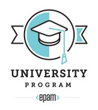

   
# **EPAM University Program**
## DevOps Educational Program 2020Q4-2021Q1
### Module 1. DevOps Introduction
* #### [TASK 1.1. Work with GIT](./m1/task1.1/README.MD)

### Module 2. Virtualization and Cloud Basic
* #### [TASK 2.1.](./m2/task2.1/README.MD)
    * #### [PART 1. Hypervisors](./m2/task2.1/part1/README.MD)
    * #### [PART 2. Work with VirtualBox](./m2/task2.1/part2/README.MD)
    * #### [PART 3. Work with Vagrant](./m2/task2.1/part3/README.MD)
* #### [TASK 2.2. Work with AWS](./m2/task2.2/README.MD)    
    * #### [PART 1. Intro](/m2/task2.2/part1/README.MD)
    * #### [PART 2. Launch a Linux Virtual Machine with Amazon Lightsail](/m2/task2.2/part2/README.MD)
    * #### [PART 3. Launch a Linux Virtual Machine without Amazon Lightsail and making of snapshot](/m2/task2.2/part3/README.MD)
    * #### [PART 4. Attach/detach disk to Virtual Machine](/m2/task2.2/part4/README.MD)
    * #### [PART 5. Launch a WordPress instance with Amazon Lightsail and domain registration with Amazon Route 53](/m2/task2.2/part5/README.MD)
    * #### [PART 6. Amazon S3 Bucket. Add and delete files](/m2/task2.2/part6/README.MD)
    * #### [PART 7. Batch upload files to the cloud to Amazon S3 using the AWS CLI](/m2/task2.2/part7/README.MD)
    * #### [PART 8. Amazon Elastic Container Service](/m2/task2.2/part8/README.MD)
    * #### [PART 9. My static website using Amazon S3 and Route 53](/m2/task2.2/part9/README.MD)
     ### [www.jundevops.com](http://www.jundevops.com)   
### Module 3. Database Administration
* #### [TASK 3.1.](./m3/task3.1/README.MD)
    * #### [PART 1. Install MySQL. Create a database and make selections](./m3/task3.1/part1/README.MD)
    * #### [PART 2. Backup of a database. Transfer to RDS AWS](./m3/task3.1/part2/README.MD)
    * #### [PART 3. Create an Amazon DynamoDB table](./m3/task3.1/part3/README.MD)
### Module 4. Networking Fundamentals
* #### [TASK 4.1.](/m4/task4.1/README.MD)
* #### [TASK 4.2.](/m4/task4.2/README.MD)
* #### [TASK 4.3.](/m4/task4.3/README.MD)
* #### [TASK 4.4.](/m4/task4.4/README.MD)
### Module 5. Linux Essentials
* #### [TASK 5.1.](./m5/task5.1/README.MD)
    * #### [PART 1. Using commands: passwd, finger, more, less, ls. Fimiliarity with help system, man and info commands](./m5/task5.1/part1/README.MD)
    * #### [PART 2. Using commands: tree, file, ls. Fimiliarity with commands find, grep, locate](./m5/task5.1/part2/README.MD)
* #### [TASK 5.2.](./m5/task5.2/README.MD)    
### Module 6. Networks using Linux
* #### [TASK 6.1. Networking with Linux](./m6/task6.1/README.MD)  
### Module 7. Linux Administration with Bash
* #### [TASK 7.1. Linux Administration with Bash](./m7/task7.1/README.MD)
### Module 8. CICD  
* #### [Task 8.1. Jenkins Task](./m8/task8.1/README.MD)
### Module 9. Python Essentials
* #### [TASK 9.1. Python Essentials](./m9/task9.1/README.MD)
### Module 10. Ansible. Configuration Management
* #### [TASK 10.1. Anisble Task](./m10/task10.1/README.MD)
### Module 11. Docker
* #### [TASK 11.1. Docker Task](./m11/task11.1/README.MD)
## [Final Project](./Final_Project/)
