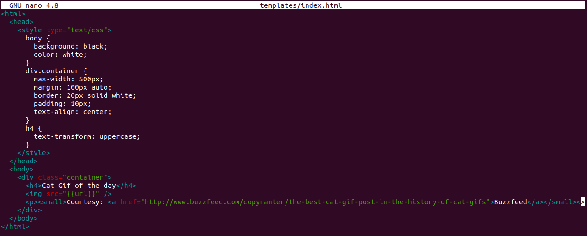

# Task 11.1. Docker task.
## Using docker lection 2 create a docker image with Python Flask app that displays random cat pix.

The goal of this exercise is to create a Docker image which will run a Flask app.  

We'll do this by first pulling together the components for a random cat picture generator built with Python Flask, then dockerizing it by writing a Dockerfile. Finally, we'll build the image, and then run it.

Сreate a flask-app directory with the following files:  

-	app.py  

-	Dockerfile  

-	requirements.txt  

-	templates/index.html  


Content of **app.py** file:  


Content of **Dockerfile** file:  


Content of **requirments.txt** file:  


Content of **index.html** file:  



Checking docker version and list of existing docker images and containers.


Launch docker image building with tag jundevops/mycatapp.


Check out what we have.


Launch our container from the jundevops/mycatapp image with port forwarding from 5000 to port 8000.

  

Enter ```localhost:8000``` in web browser and check out our web application. Click the Refresh button a couple of times.


  

List all the images and containers that we have by typing ```docker image ls``` and ```docker ps -a``` commands.

  

Login to Docker Hub with ```docker login```. After that you must enter your username and password for your account. I already have a Docker Hub account – **jundevops**.

And push our image to Docker Hub registry.

   
 
Check on Docker Hub site that our image has been downloaded.

  


