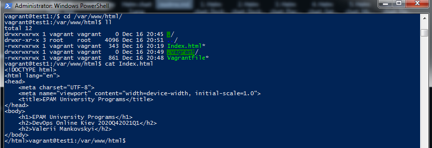

## PART 3. WORK WITH VAGRANT 

Download the required version of Vagrant according to the instructions [5] and according to the host operating system (OS) installed on the student's workplace.
Download and install Vagrant.


Run the powershell as administrator. Create a folder "Valerii".


Move to Valerii folder and initialize the environment with the degault Vagrant box:

> vagrant init hashicorp/precise64


Create and configure guest machines according to Vagrantfile:

> vagrant up


Connect to running machine using SSH via MobaXterm.

IP address: 127.0.0.1

Port: 2222

Login: vagrant

Password: vagrant

And running date command on guest machine:
> date


Shutting and Deleting machine:

> vagrant halt

> vagrant destroy


## Create a test environment from a few servers.

First of all we initialized the environment with default Vagrant box and got Vagrant file for editing.

> vagrant init hashicorp-vagrant/ubuntu-16.04


Сhanged the Vagrantfile file for our purposes.


Also I wrote a little html page and puted it in folder with Vagrant file.

```sh
<!DOCTYPE html>
<html lang="en">
<head>
    <meta charset="UTF-8">
    <meta name="viewport" content="width=device-width, initial-scale=1.0">
    <title>EPAM University Programs</title>
</head>
<body>
    <h1>EPAM University Programs</h1>
    <h2>DevOps Online Kiev 2020Q42021Q1</h2>
    <h2>Valerii Mankovskyi</h2>
</body>
</html>
```

Used command below to create/configure guest machines according to our Vagrantfile.

> vagrant up


Connect to running machine using SSH

>vagrant ssh test1

>vagrant ssh test2

Cheking for Apache Server





After that cheking for my page in browser


