# PART 1. Launch a Linux Virtual Machine with Amazon Lightsail

#### Choose Amazon Lightsail. Select AWS Region, Availability Zone, platform and a type of a blueprint.

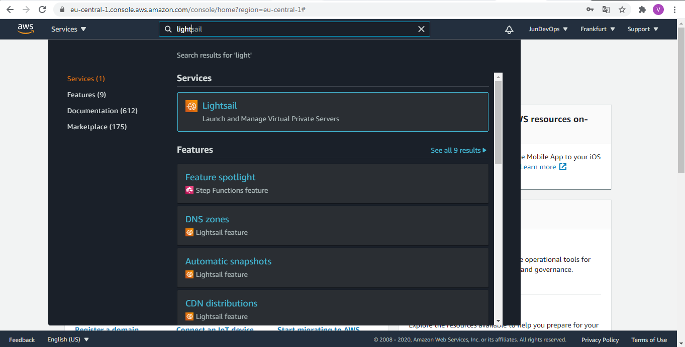      
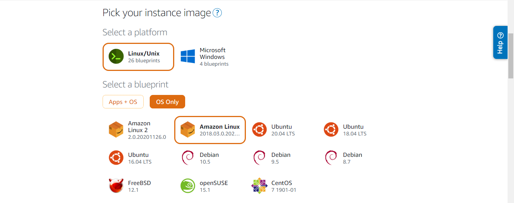     
     

#### If you wish you can add a launch script. 

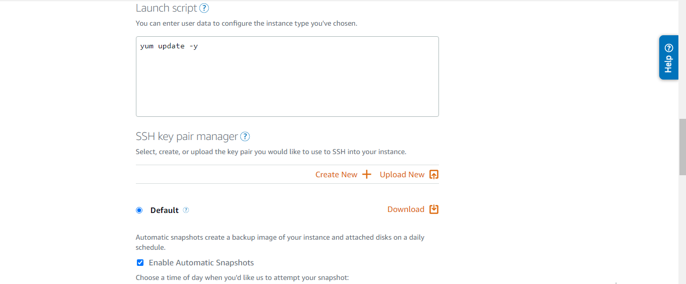      
  

#### Choose SSH key pair you would like to use to SSH into your instance. Instance plan and identify your instance and press Create instance.

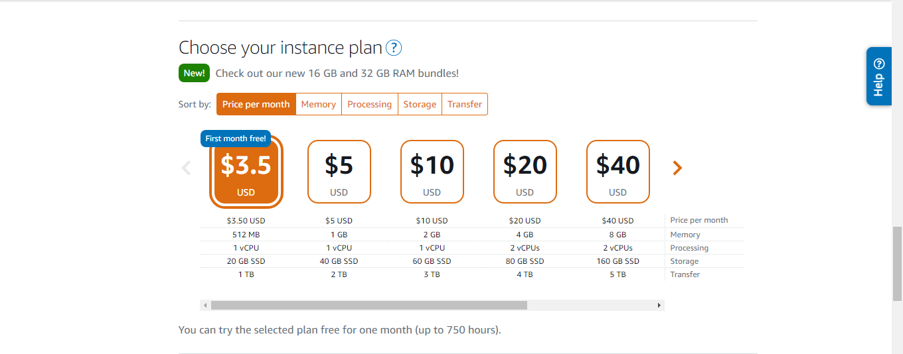      
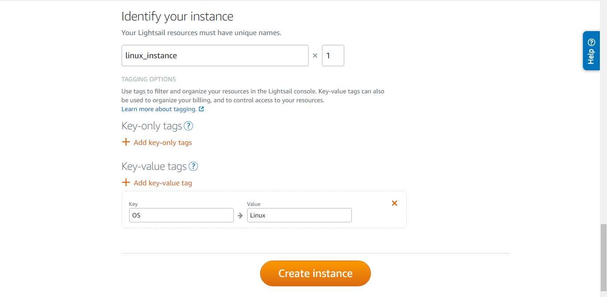 
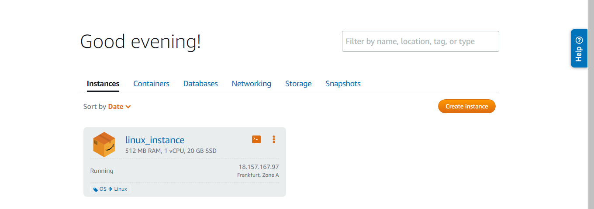  

#### Connect to your instance using the browser-based SSH terminal in Lightsail or use MobaXterm with saved key pair.
 
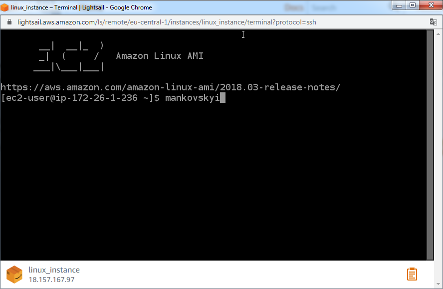      
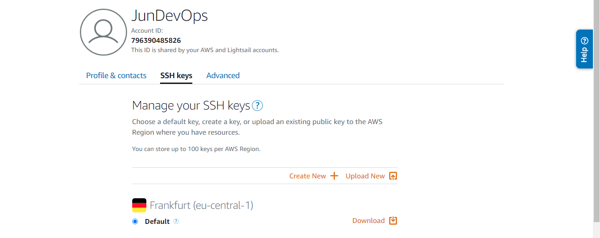 
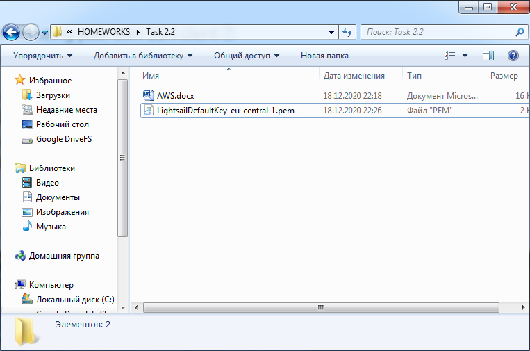 
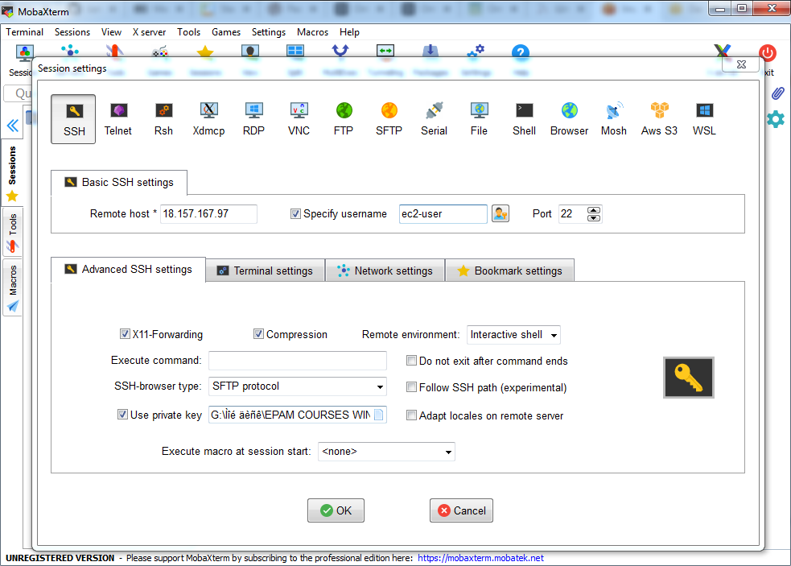      
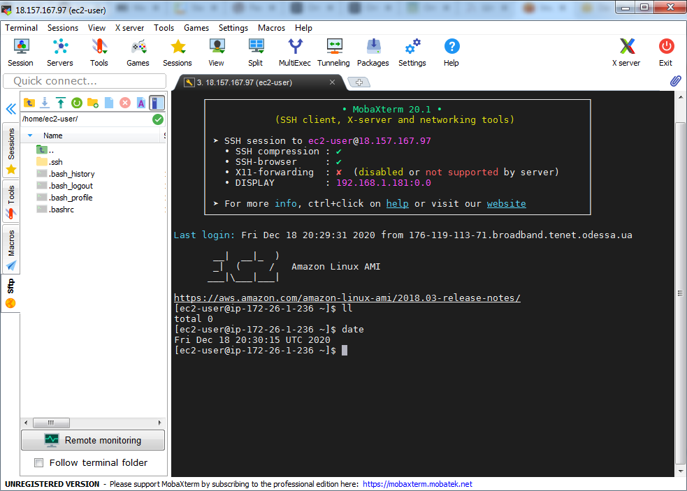 
