# PART 3. Launch a Linux Virtual Machine without Amazon Lightsail and making of snapshot 

#### In this task a will launch another Linux Virtual Machine without Amazon Lightsail and create a snapshot of an instance to keep as a backup.

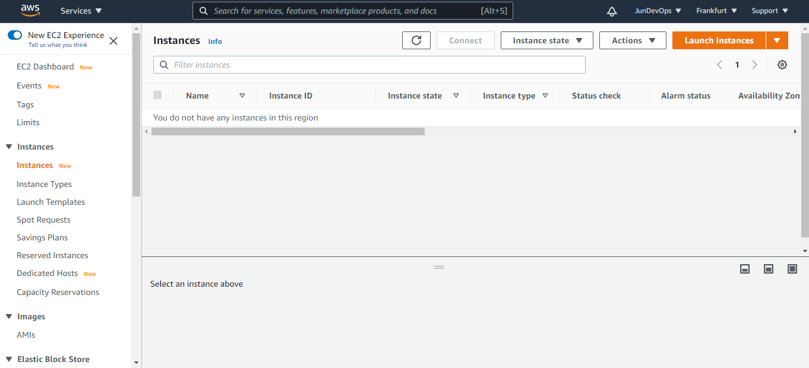

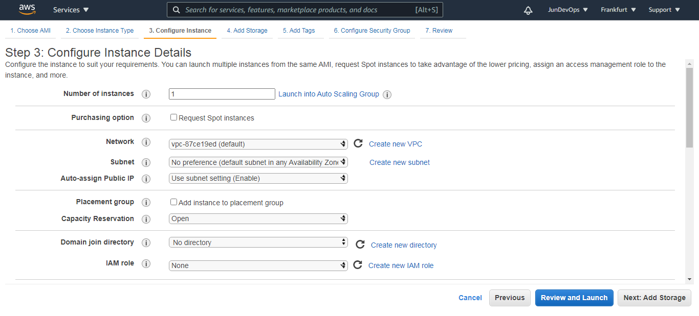

     

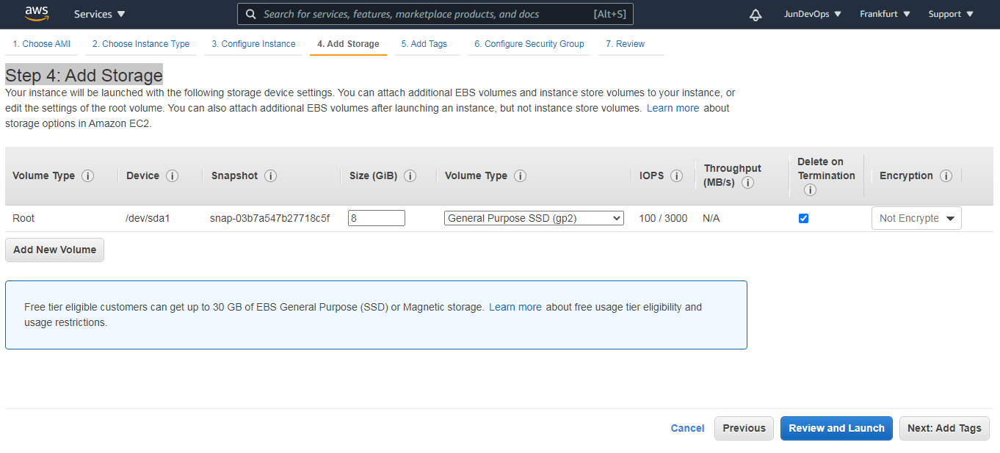   

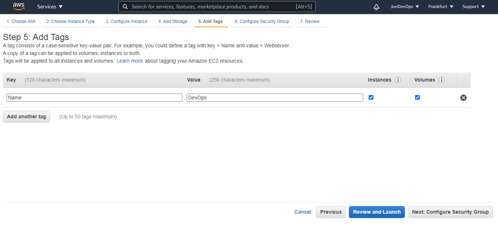      

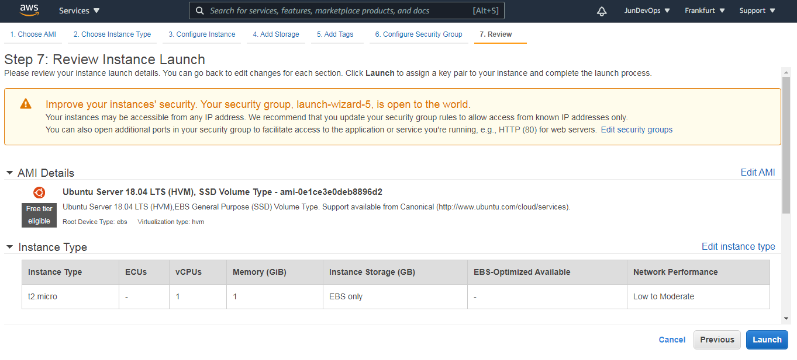 

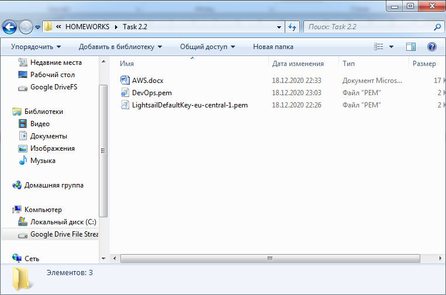  
 
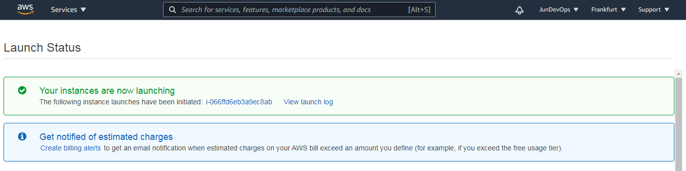      

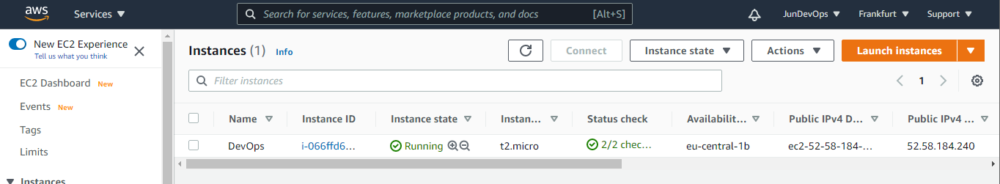 

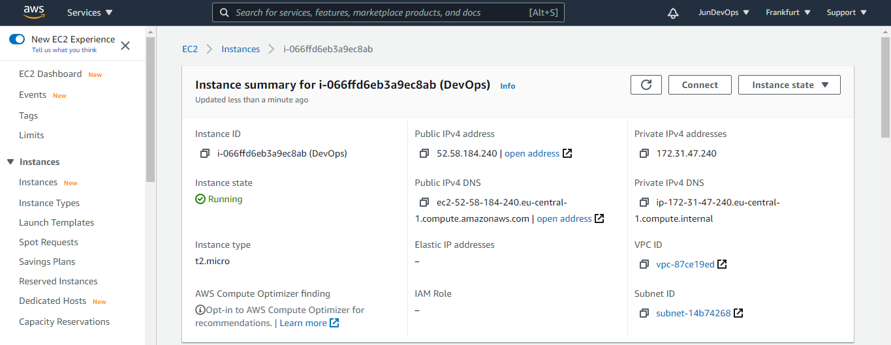 

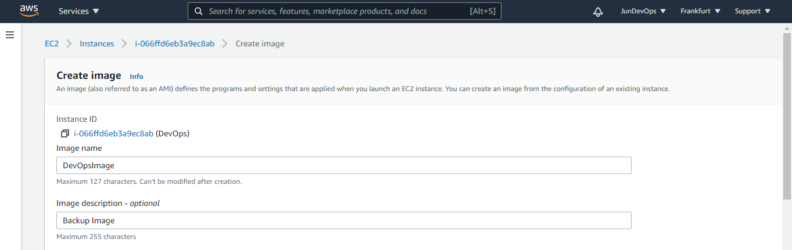     

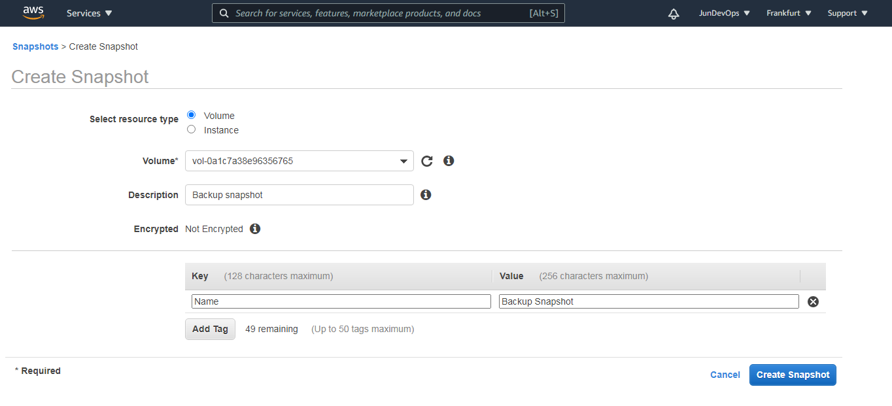 

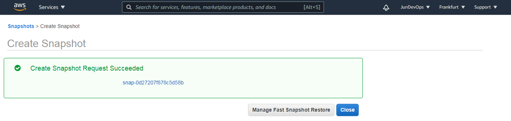     

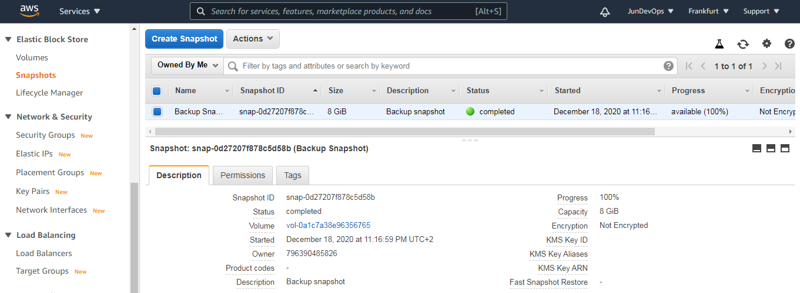 
