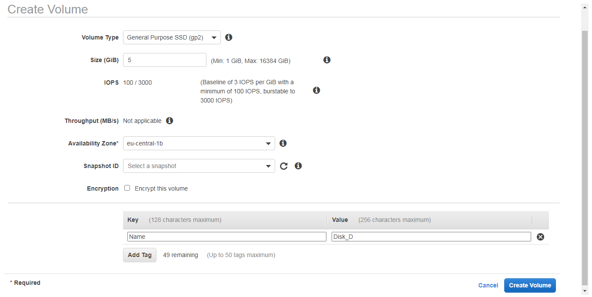
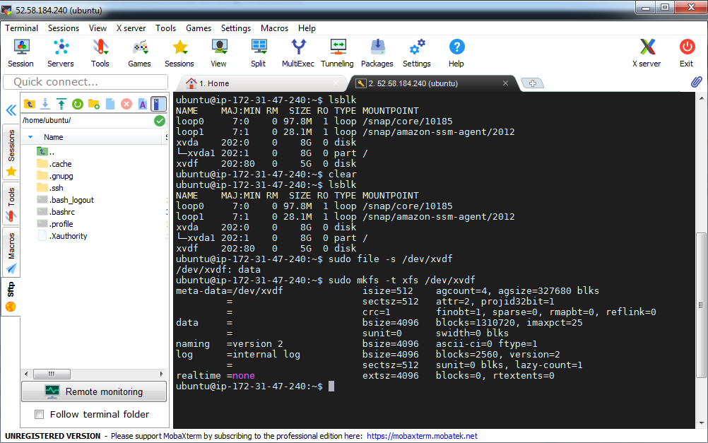

# PART 4. Attach/detach disk to Virtual Machine

#### In this task a will create and attach a Disk_D (EBS) to my instance to add more storage space. Create and save some file on Disk_D. Launch the third instance from backup.
Detach Disk_D from the 2nd instance and attach disk_D to the third instance.

     

   

      

 

  
 
      

 

 

     

 

     

 

 

     

 

     

 
