# PART 5. Launch a WordPress instance with Amazon Lightsail and domain registration with Amazon Route 53

#### In this task a will Launch a WordPress instance with Amazon Lightsail, attach static IP and make registreation of my own domain jundevops.com

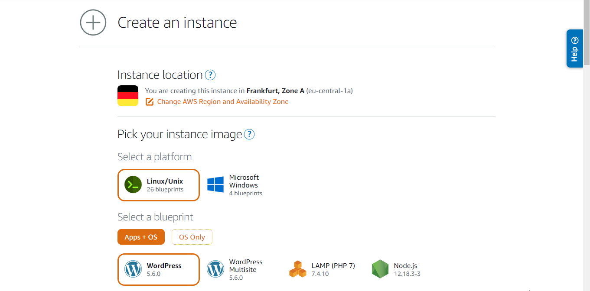

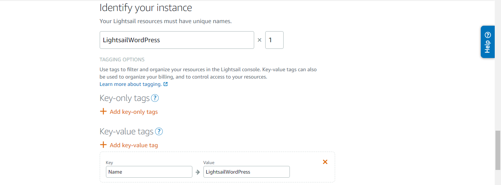

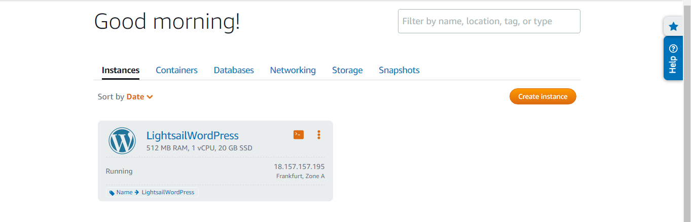

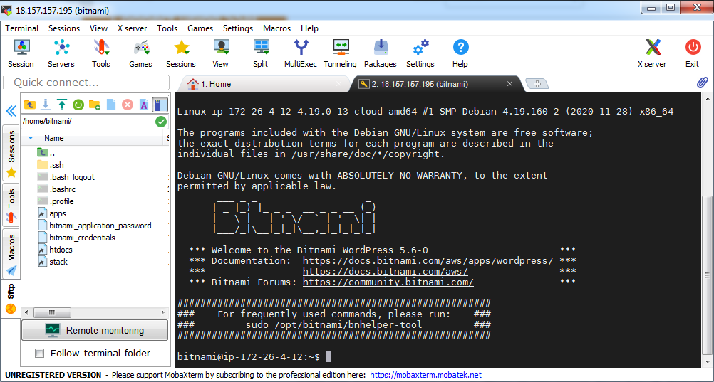     

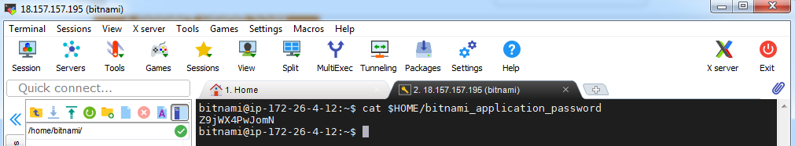    

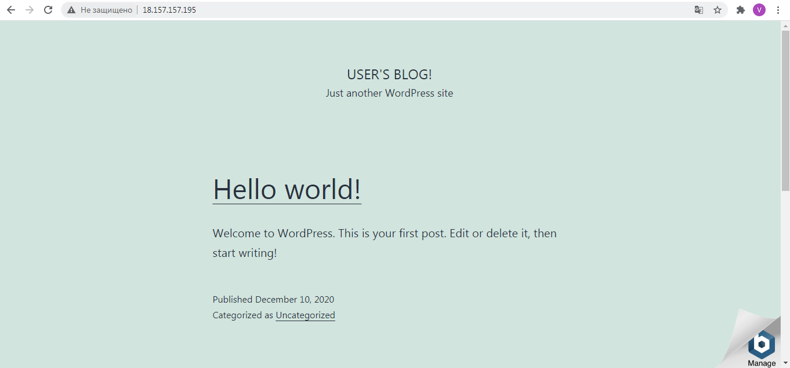      

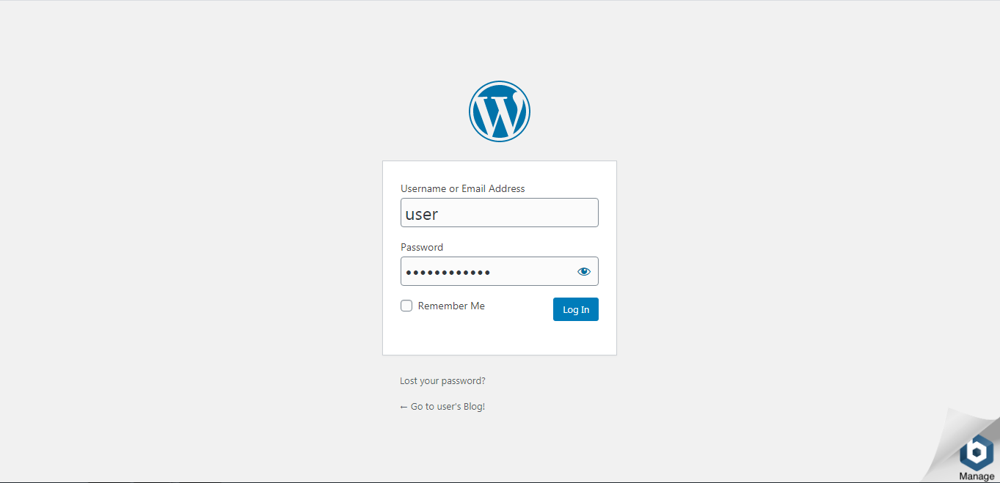 

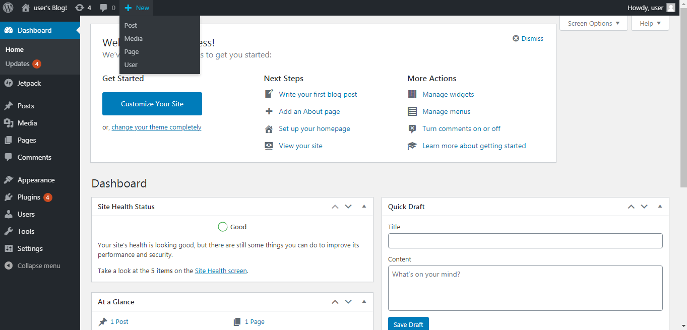  
 
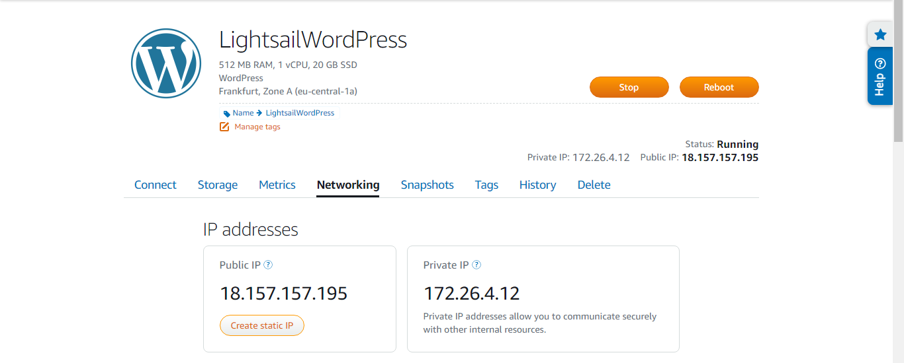      

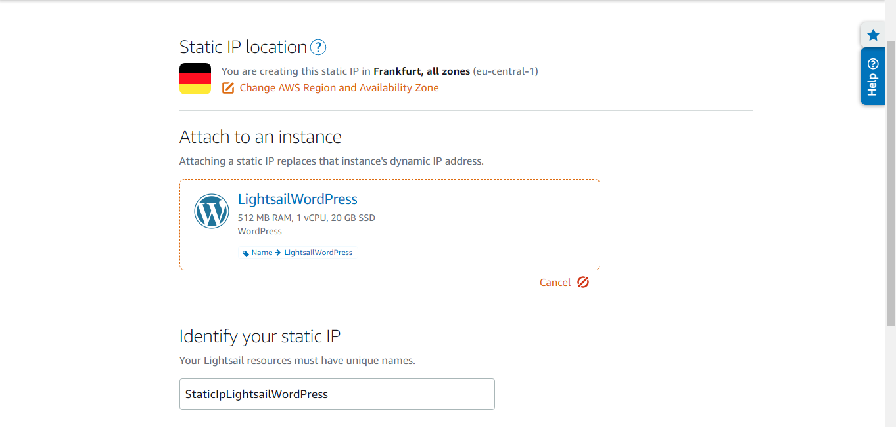 

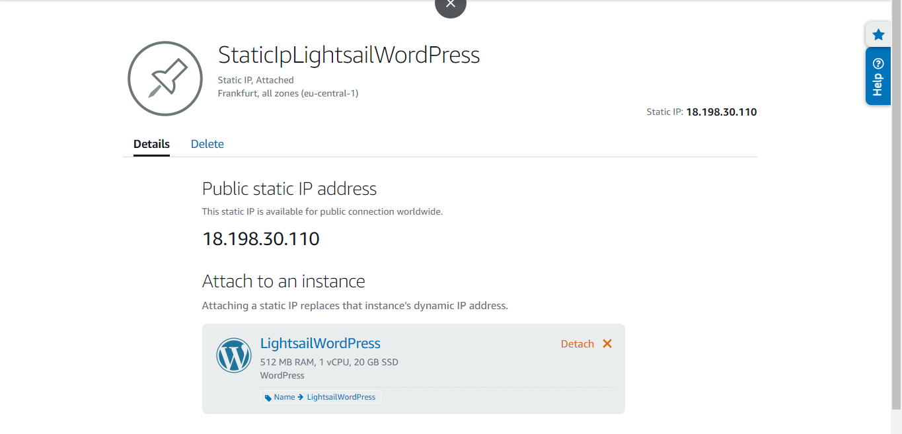 

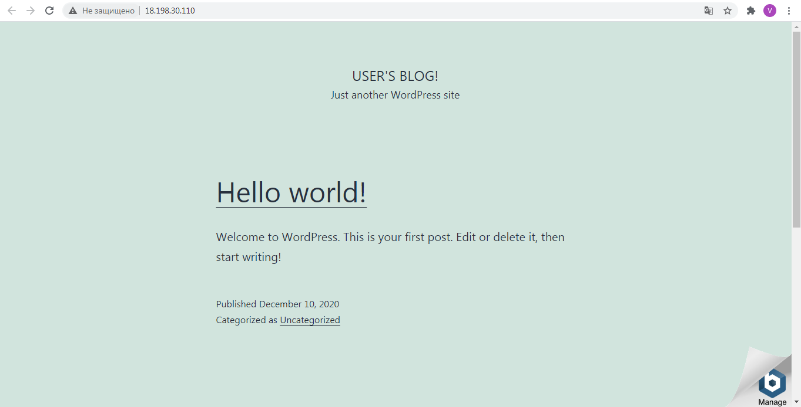     

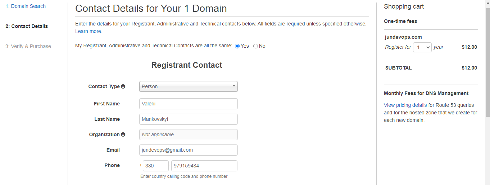 

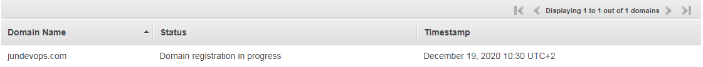     

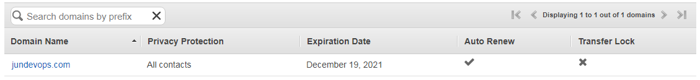 

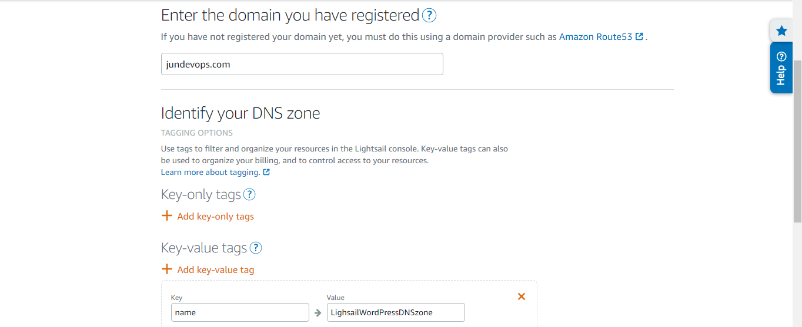 

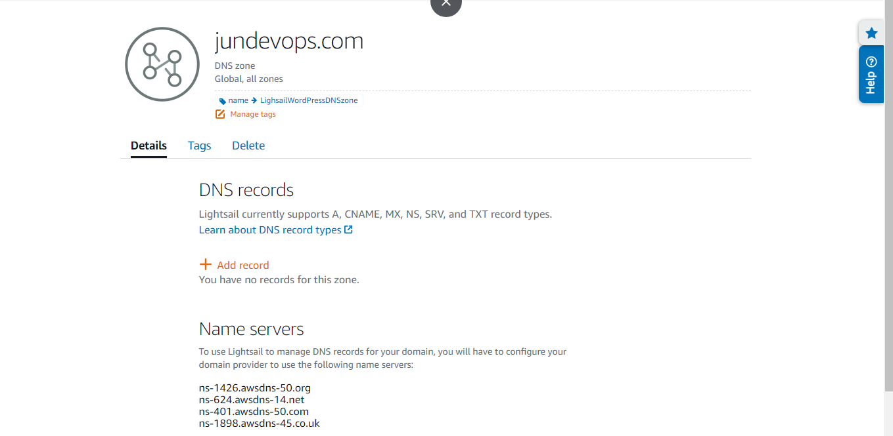     

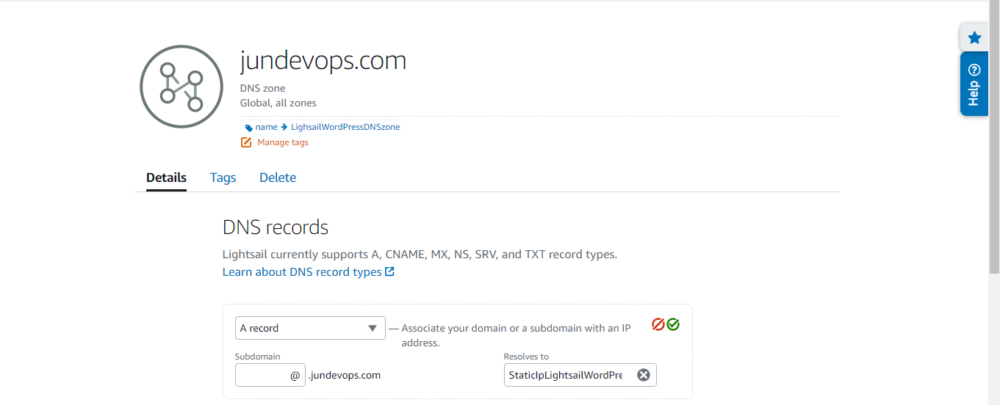 

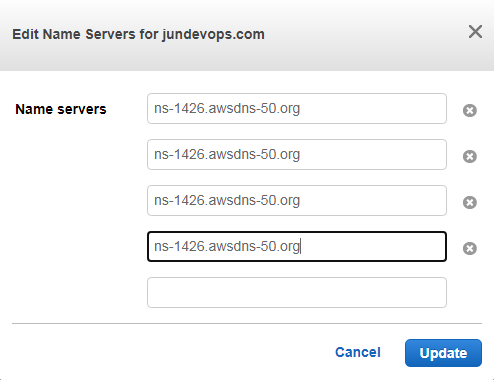     

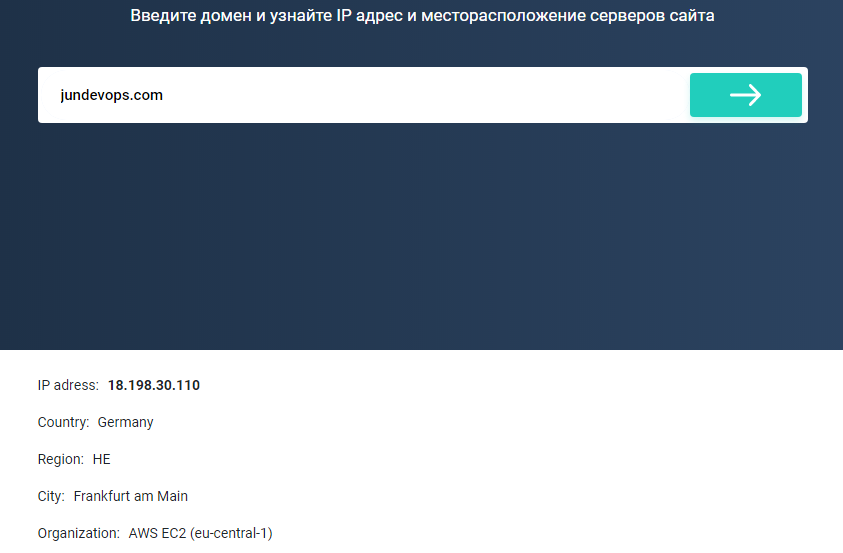 

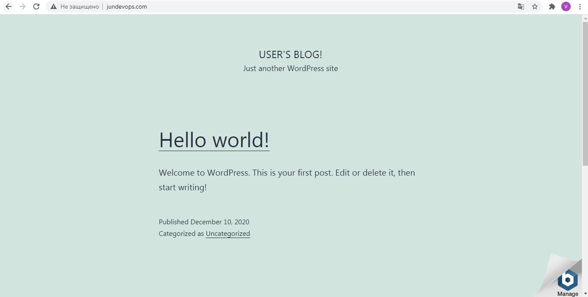 
