# PART 7. Batch upload files to the cloud to Amazon S3 using the AWS CLI

#### In this task a will batch upload files to the cloud to Amazon S3 using the AWS CLI. Create a user AWS IAM, configure CLI AWS and upload any files to S3.

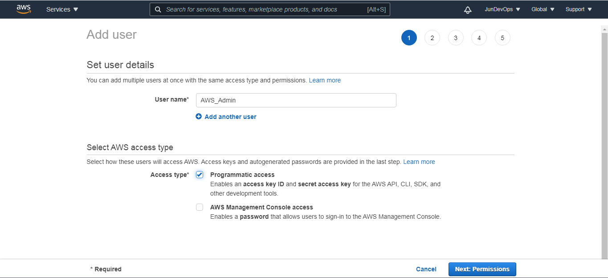

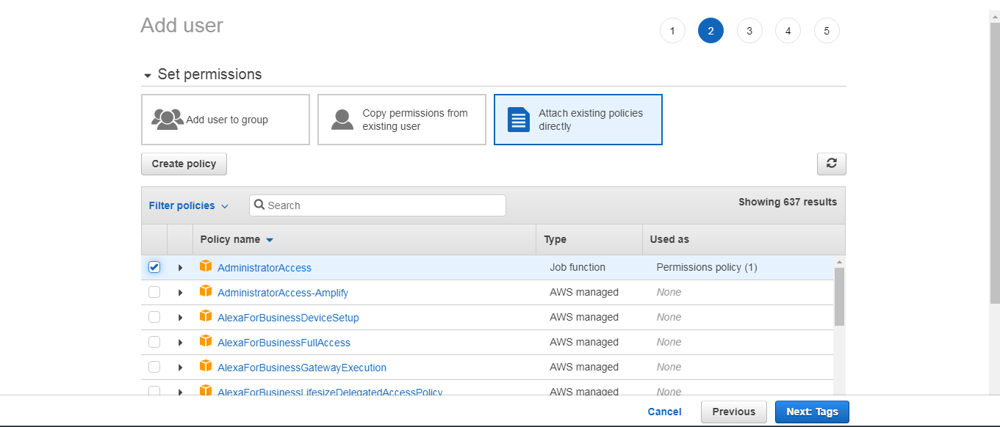

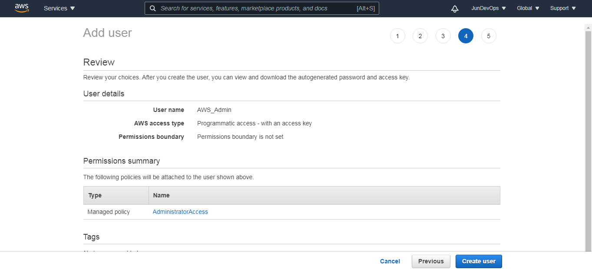

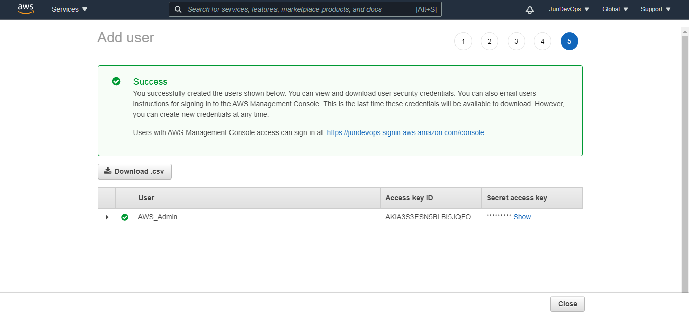     

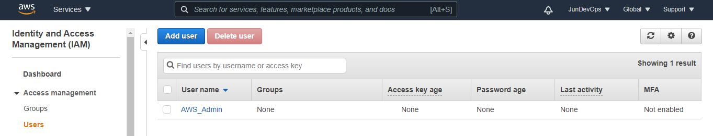    

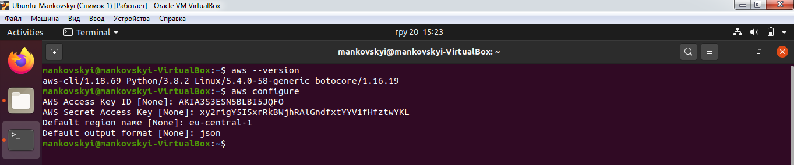      

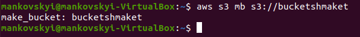 

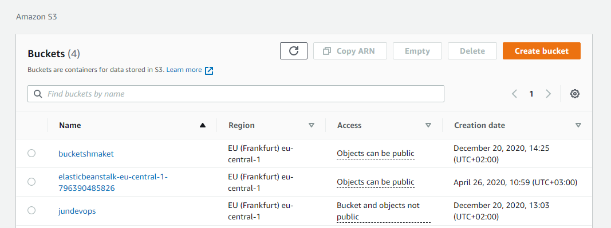  
 
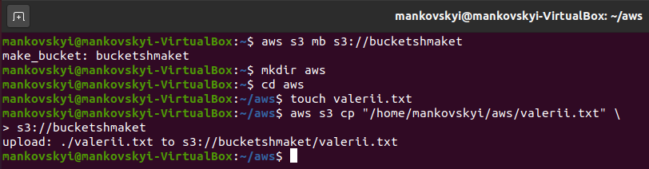      

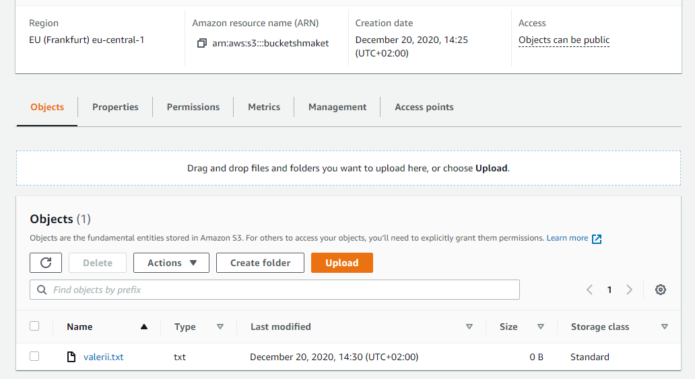 

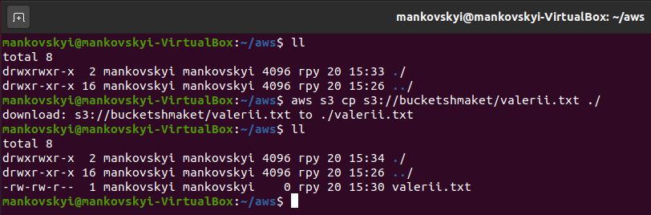 

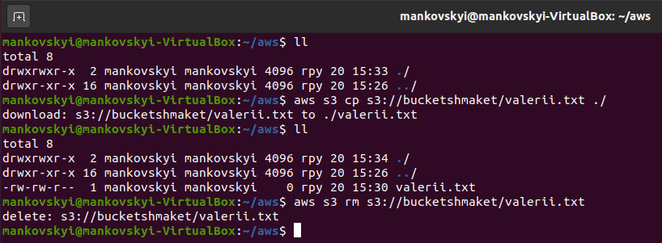     

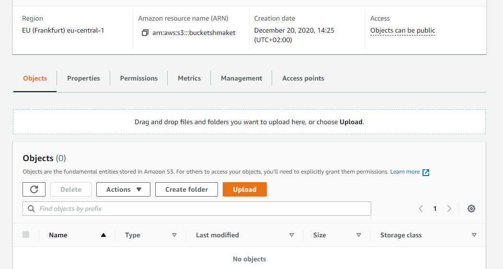 
