# PART 8. Amazon Elastic Container Service

#### In this task a will Deploy Docker Containers on Amazon Elastic Container Service (Amazon ECS). Create a cluster and run the sample app.

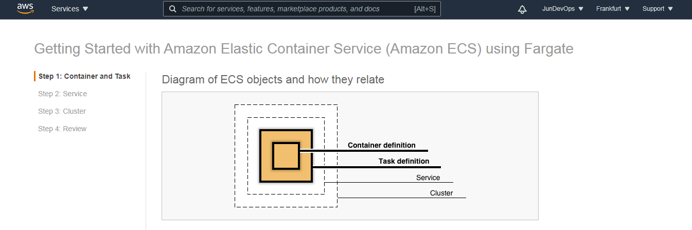

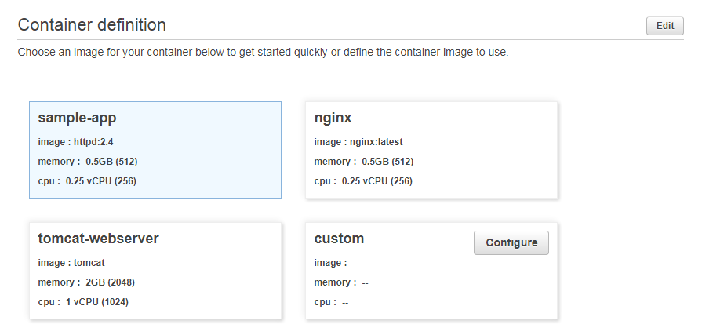

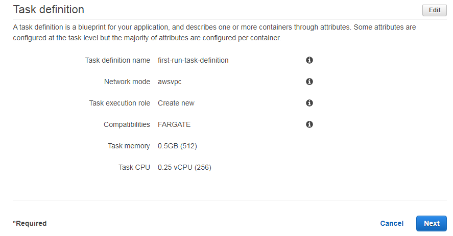

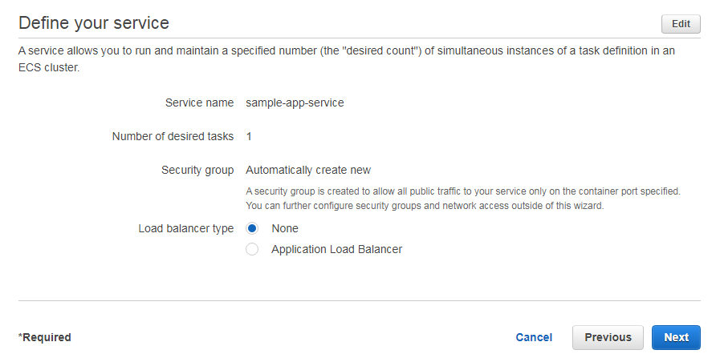     

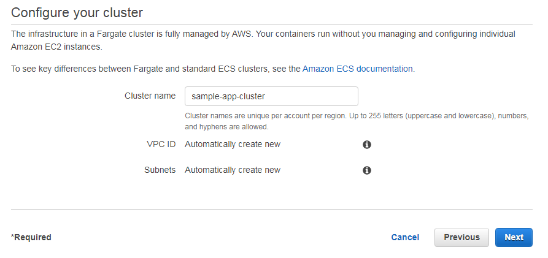    

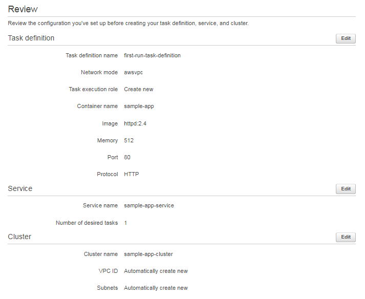      

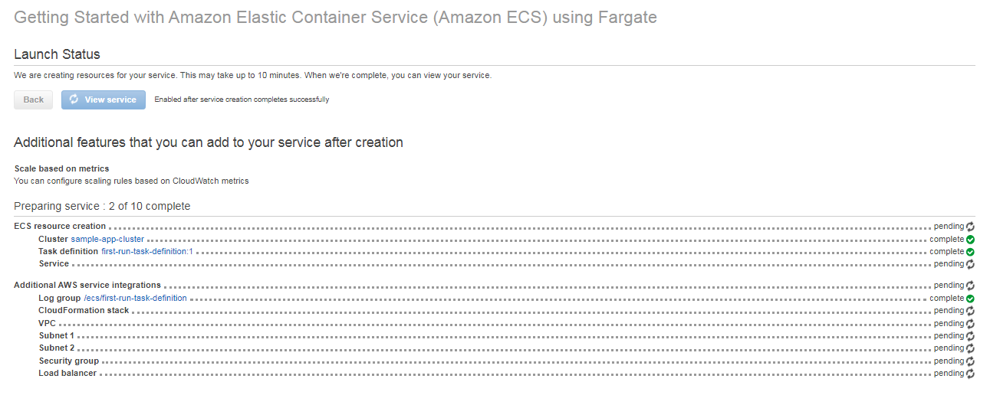 

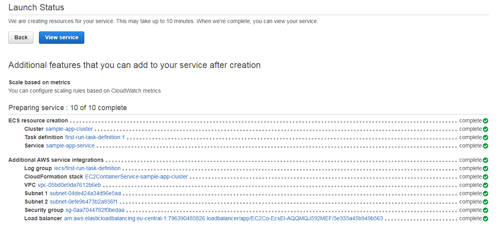  
 
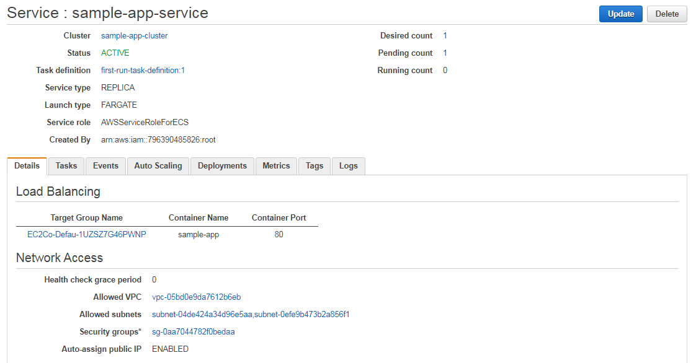      

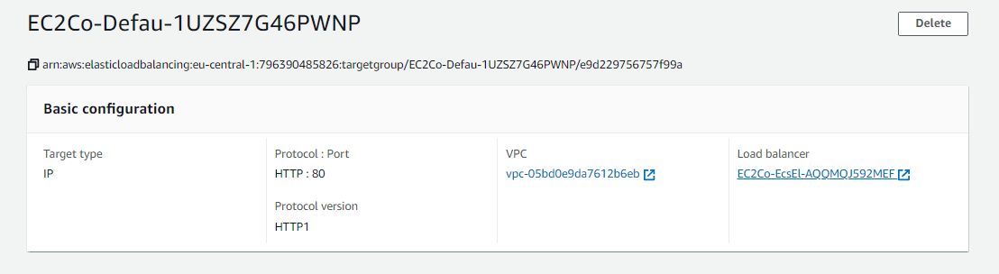 

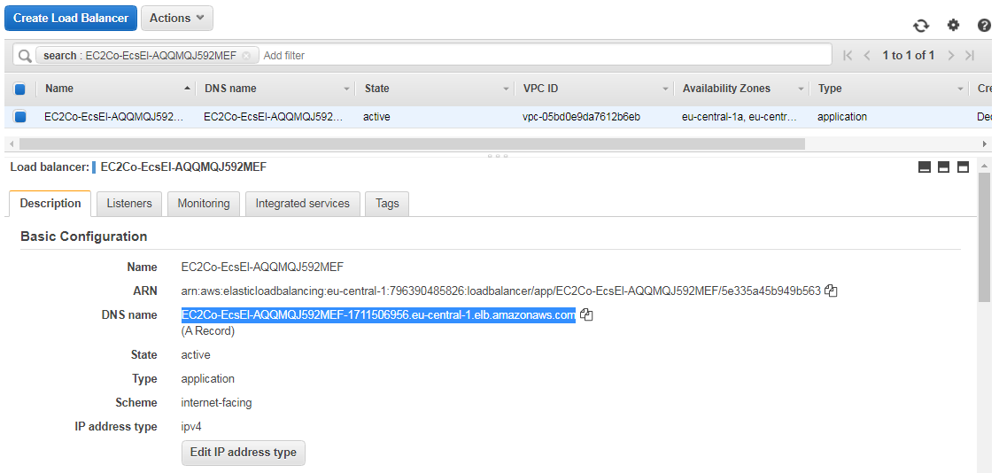 

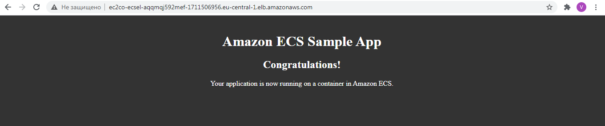    
