# PART 9. My static website using Amazon S3 and Route 53  

#### In this task i will configure an Amazon S3 bucket to function like a website.

#### Step 1: Register a custom domain with Route 53. A have already registered domain jundevops.com

#### Step 2: Create two buckets.

Domain bucket – jundevops.com  
Subdomain bucket – www.jundevops.com

  

#### Step 3: Configure your root domain and subdomain buckets for website hosting

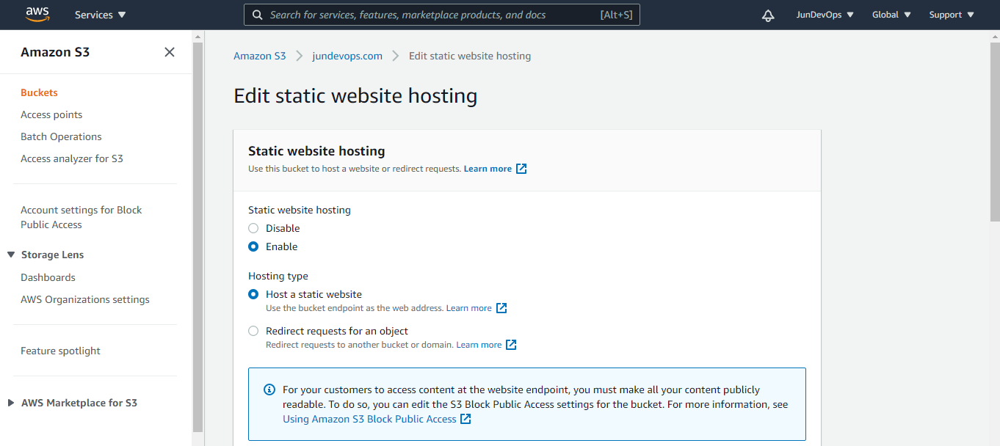

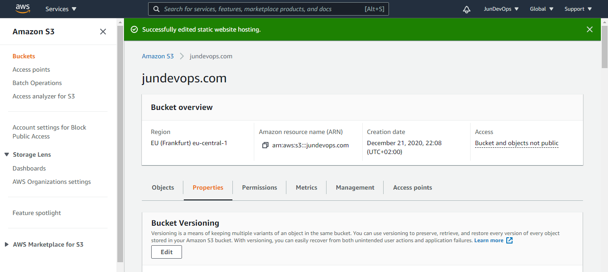

#### Step 4: Edit S3 Block Public Access settings and attach a bucket policy

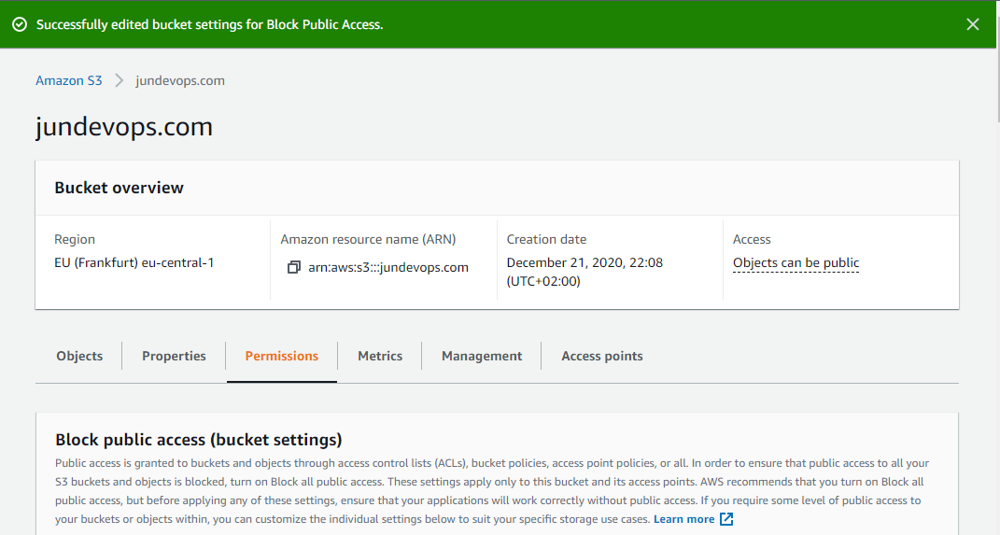

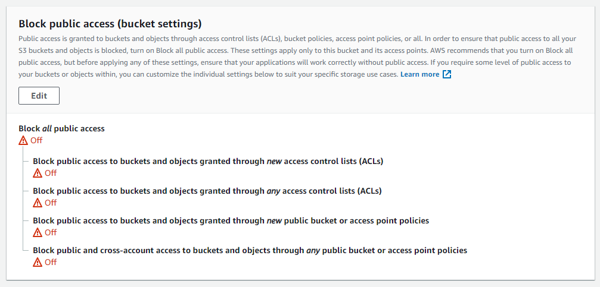

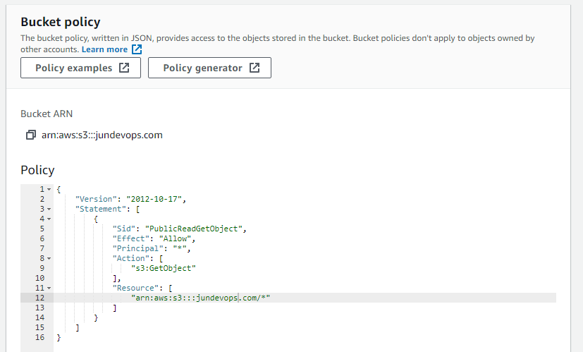

#### Step 5: Upload index and website content

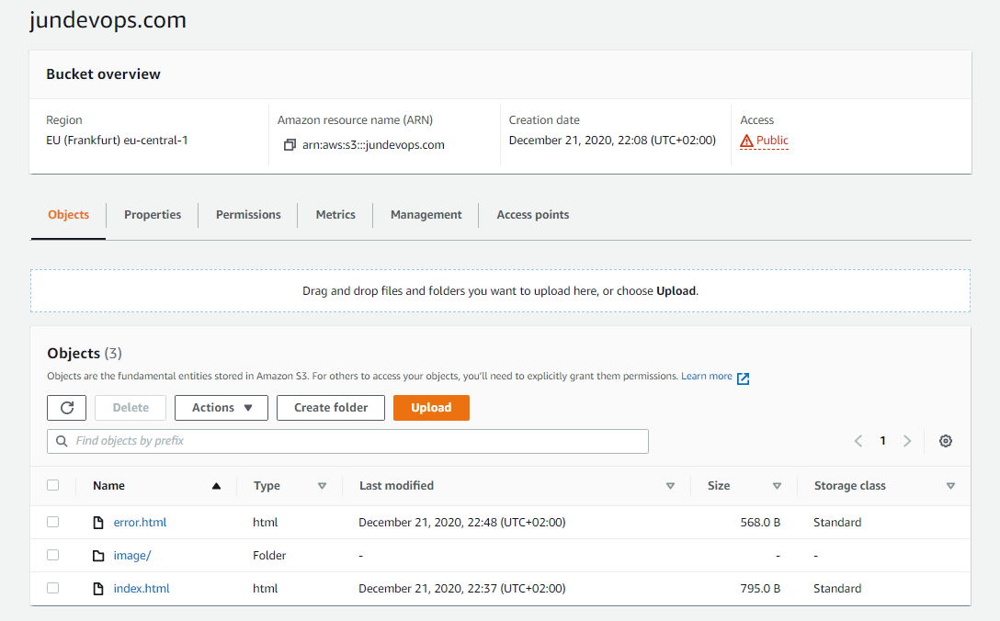

#### Step 6: Test your domain endpoint: 

jundevops.com.s3-website.eu-central-1.amazonaws.com   
www.jundevops.com.s3-website.eu-central-1.amazonaws.com

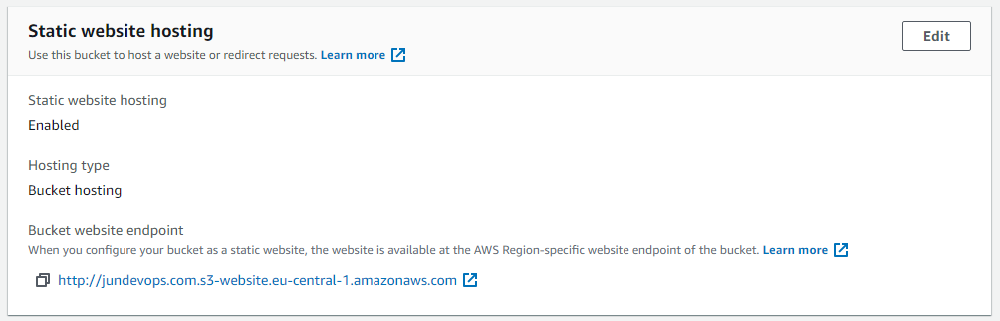

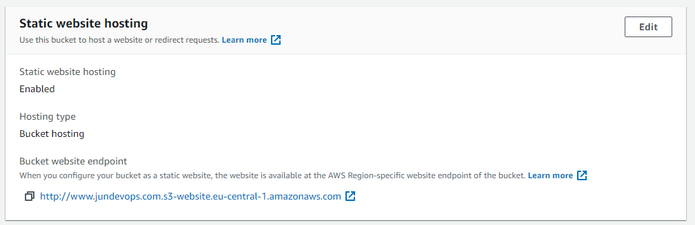

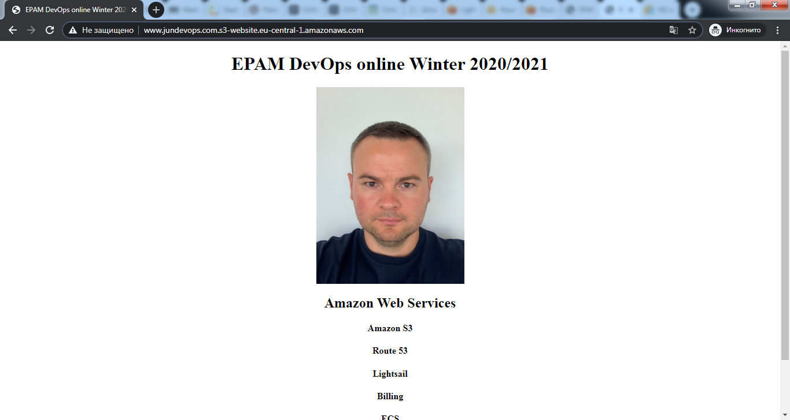

#### Step 7: Create Hosted Zone and add alias records for your domain and subdomain

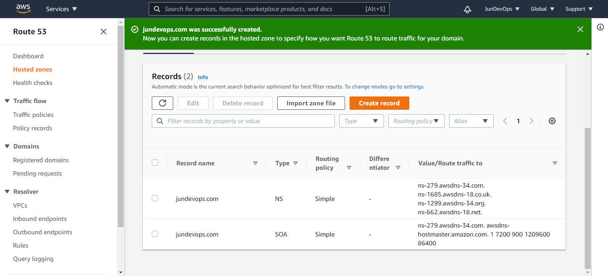

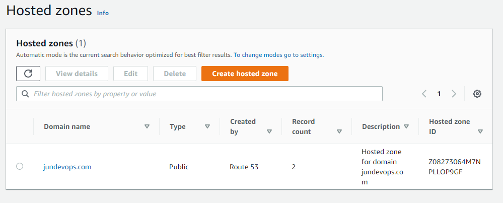

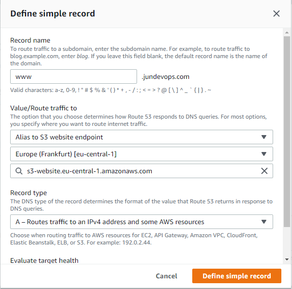

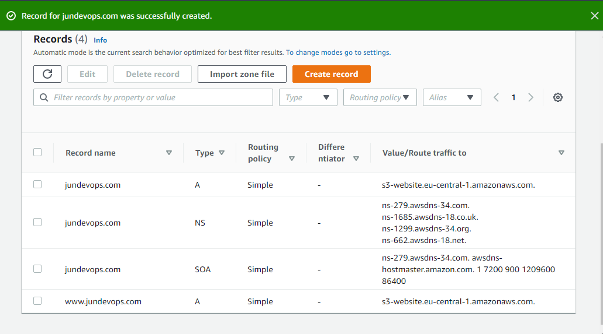

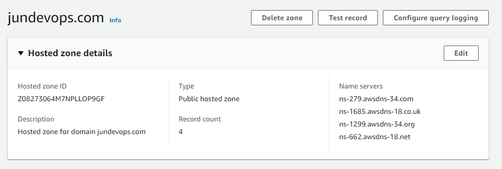

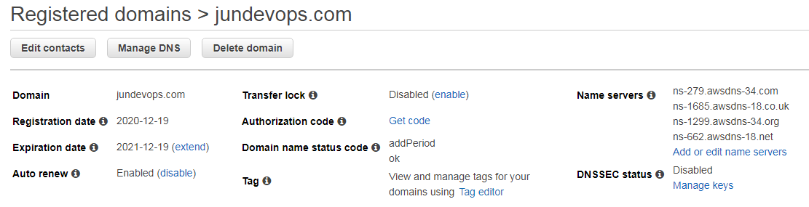

#### Step 8: Test the websites www.jundevops.com and jundevops.com 

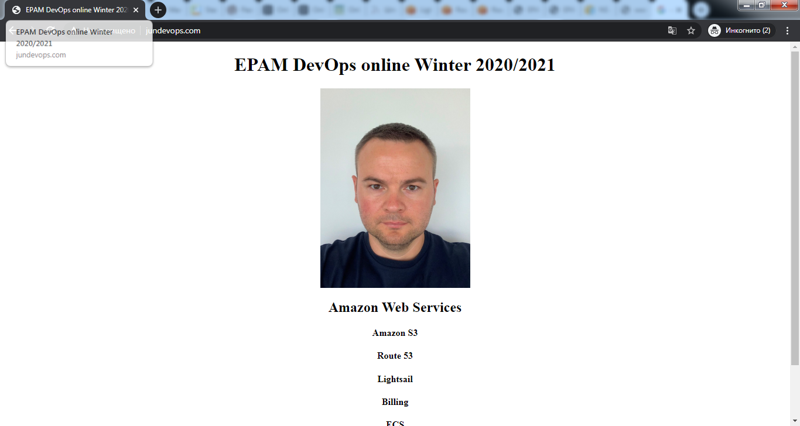

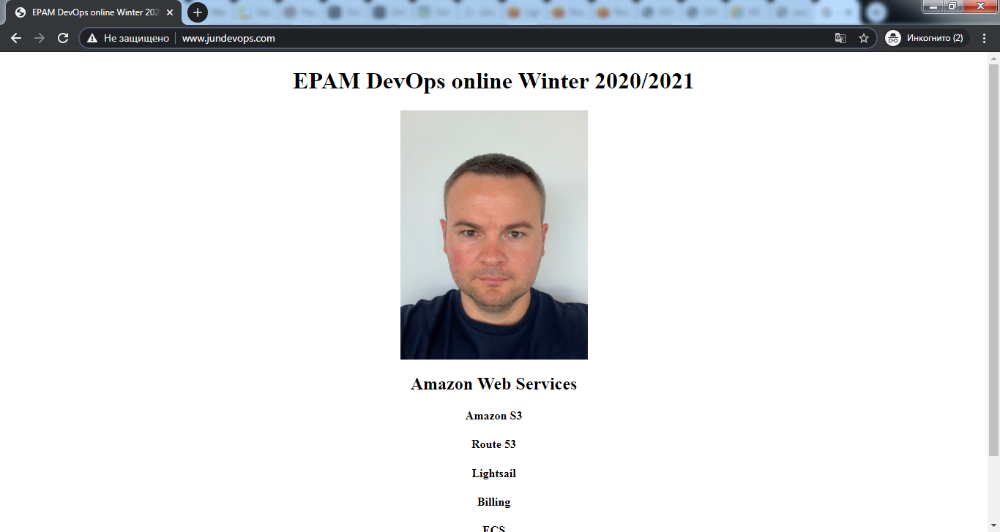

#### What happens if we enter the website address with a typo, you can see below

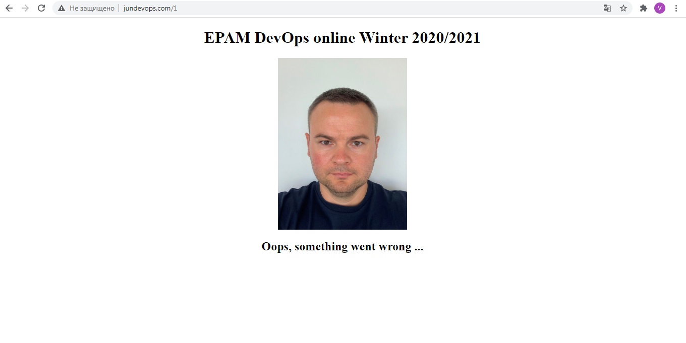

## The list with links of completed labs is based on tutorials.

-	Launch a Linux Virtual Machine with Amazon Lightsail  
https://aws.amazon.com/getting-started/hands-on/launch-a-virtual-machine/

-	Launch and configure a WordPress instance with Amazon Lightsail  
https://aws.amazon.com/getting-started/hands-on/launch-a-wordpress-website/?trk=gs_card

-	Store and Retrieve a File with Amazon S3  
https://aws.amazon.com/getting-started/hands-on/backup-files-to-amazon-s3/

-	Batch upload files to the cloud to Amazon S3 using the AWS CLI  
https://aws.amazon.com/getting-started/hands-on/backup-to-s3-cli/?nc1=h_ls

-	Register a Domain Name with Amazon Route 53  
https://aws.amazon.com/getting-started/hands-on/get-a-domain/?nc1=h_ls

-	Deploy Docker Containers on Amazon Elastic Container Service (Amazon ECS)  
https://aws.amazon.com/getting-started/hands-on/deploy-docker-containers/?nc1=h_ls

-	Configuring a static website using a custom domain registered with Route 53  
https://docs.aws.amazon.com/AmazonS3/latest/dev/website-hosting-custom-domain-walkthrough.html

## The screenshot from amazon.qwiklabs.com with list of completed labs.

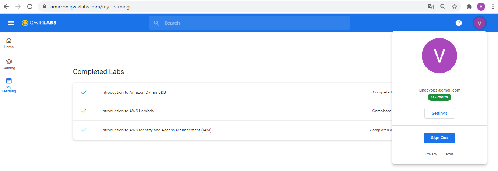  

# [www.jundevops.com](http://www.jundevops.com)

