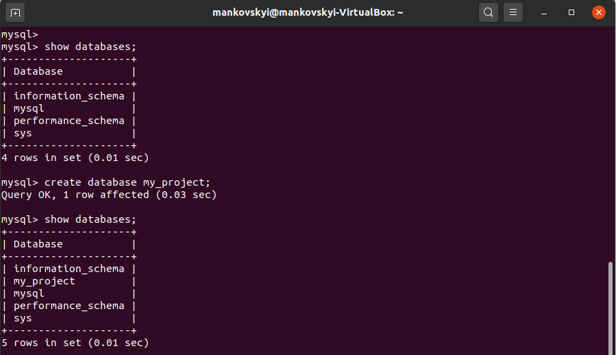
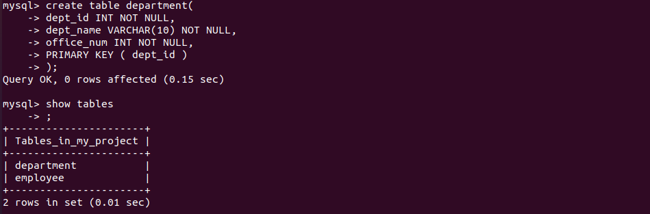

# PART 1. Install MySQL. Create a database and make selections 

#### Install MySQL server on VM. 

  

 

 

 

 

 

 

 

#### Create a database on the server through the console. Describe the database schema. Fill in tables.

      

 

 

     

 

     

 

 

     

 

#### Construct and execute SELECT operator with WHERE, GROUP BY and ORDER BY.

     

 

 

#### Execute other different SQL queries DDL, DML, DCL.

     

 

 

     

 

#### Create a database of new users with different privileges. Connect to the database as a new user and verify that the privileges allow or deny certain actions.

     

 

 

     

 

     

 

#### Make a selection from the main table DB MySQL.

 

     

 
