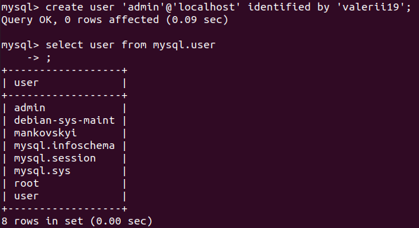
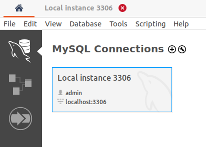

# PART 2. Backup of a database. Transfer to RDS AWS 

#### Make backup of your database.

  

 

 

#### Delete the table and/or part of the data in the table.

 

#### Restore your database.  

 

 

#### Create a user **admin** wit all privileges and connect to local database via MySQL Workbench.  

 

     

 

     

 

 

    

#### Create a RDS AWS. 

 

     

 

 

     

 

 

#### Find out your public IP and add to inbound rules in Security Groups for RDS.

     

 

#### Connect to your RDS AWS and transfer your local database.

     

 

 

     

 

#### Connect to your database and execute SELECT operator.

     

 

#### Create the dump of your database.

 

