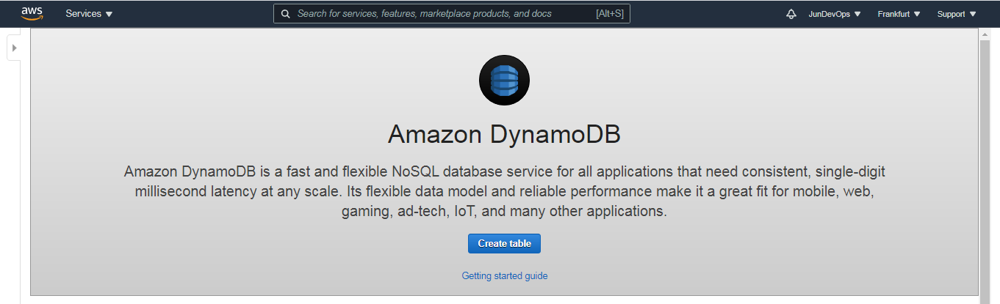
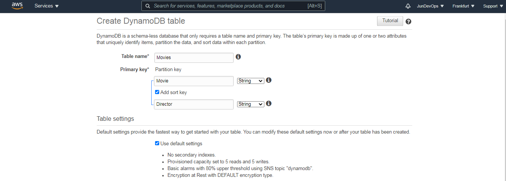
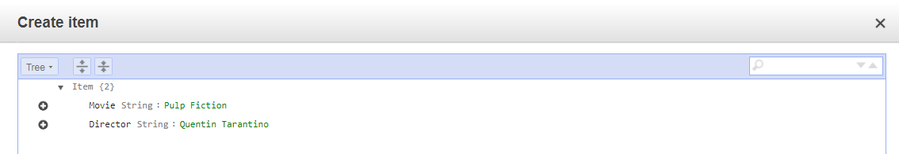
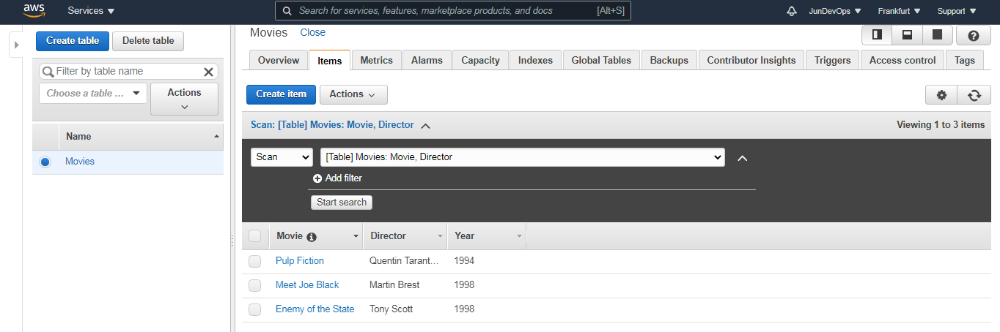
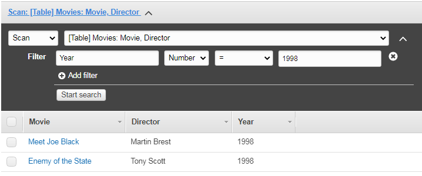

# PART 3. Create an Amazon DynamoDB table  

#### Create an Amazon DynamoDB table in AWS.  
In the AWS Managment Console, click **Services**, then click **DynamoDB**.  

   

Click **Create table**. Enter **Table name**, **Primary** and some **Sort key**. 

    

#### Enter data into an Amazon DynamoDB table.

Add some data. Click the **Items** tab, then click **Create item**.
Type "Pulp Fiction" for "Movies" and "Quentin Tarantino" for "Director".

    

  

#### Query an Amazon DynamoDB table using Query and Scan.

There are two ways to query a DynamoDB: Query and Scan.

Change the drop-down list to Query and enter some details:

**Partition key:** Meet joe Black
**Sort key:** Martin Brest 

    

Change the drop-down list to Scan and enter some details:

**Filter:** Year 
**Value:** 1998

  
