# TASK 4.1. 

Assemble a project that includes: 4 PCs such as PC-PT, Hub-PT. Each computer must be connected to the hub using a twisted pair (Copper Straight-through). Assign a unique IP address to each PC. To assign it, you need to go to the PC configuration menu by clicking on it once with the left mouse button and selecting the Config / Interface tab. In the field ip address it is necessary to enter the corresponding address, and in the field Subnet Mask - according to this address a mask.

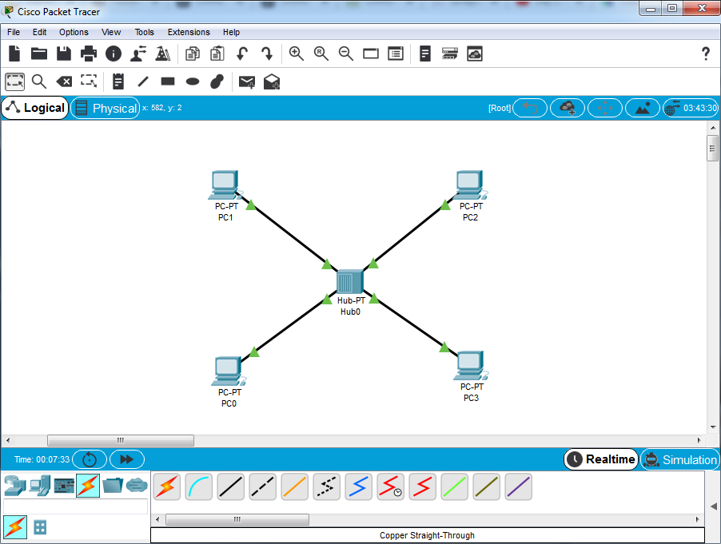  

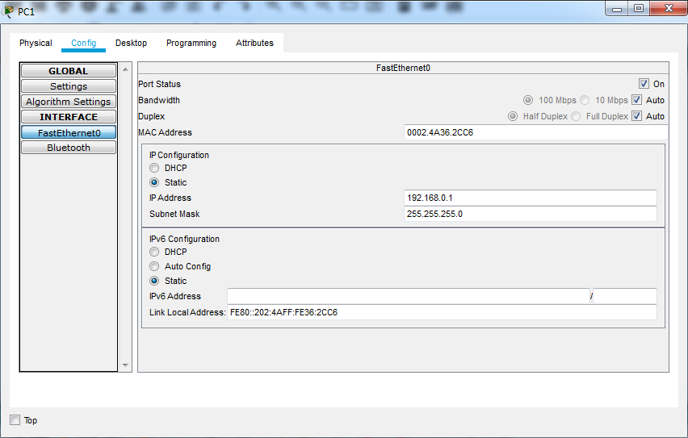 

Check the functionality of the received network by making Internet requests (ICMP packets) from one PC to another. To assign such a PC package, use the ADD SIMPLE PDU button on the right side of the work window. Then left-click on the local source machine, then - on the recipient machine. Check network performance.

Switch to Simulation mode and use the Event List button to bring up the window displaying events in the Simulation Panel network. 
Use the Auto Capture / Play button to start the simulation of ICMP packets. Track the promotion of packets over the network. 
Follow the order and by passing the packages in the Simulation Panel window.
View information about packages from the Simulation Panel window and their compliance with the OSI model by double-clicking the package in the window.

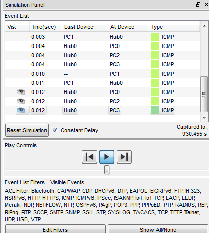 

 

Delete the IP address from each local machine PC0 - PC3. Analyze the differences in the network.

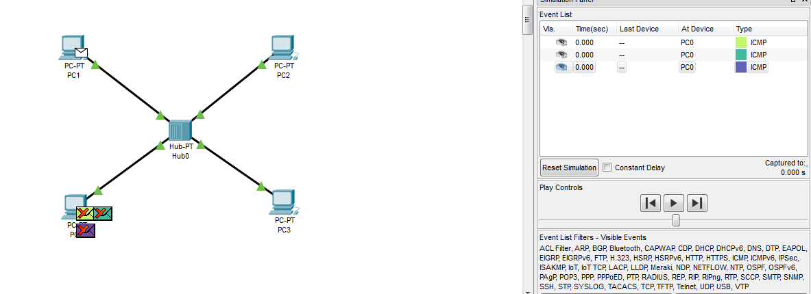 

Assemble the following project: PC0-PC5, Server, 2 Hubs.
Devices of the same name are connected using a cross cable (Copper Cross-over).
Check network performance.

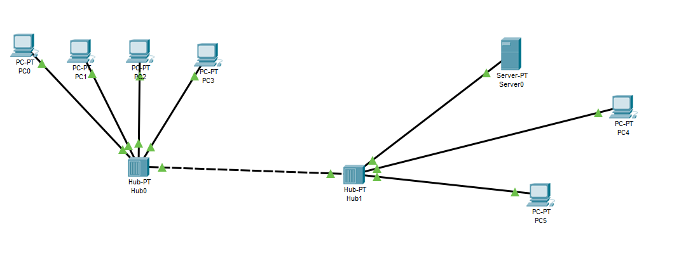 

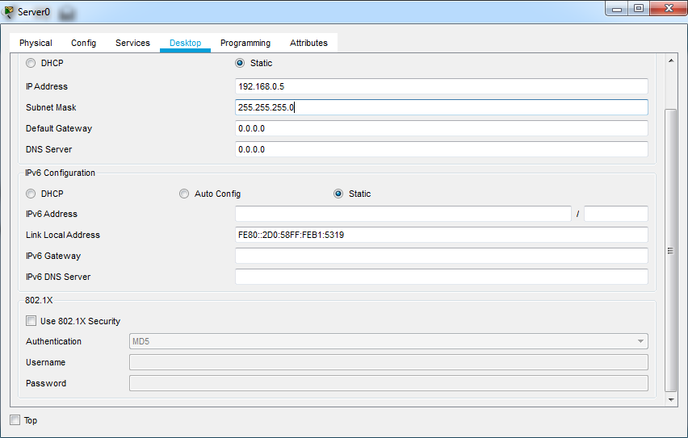 

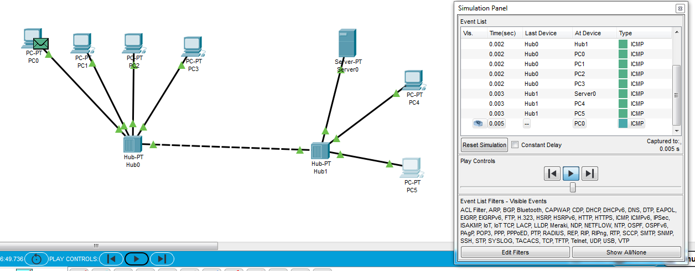 

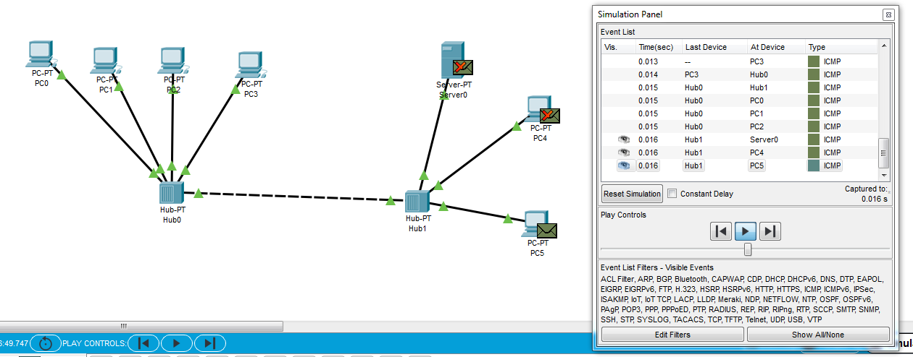 

 

Create a new project: 4 PCs such as PC-PT, Switch.
Each computer must be connected to the hub using a twisted pair (Copper Straight-through).

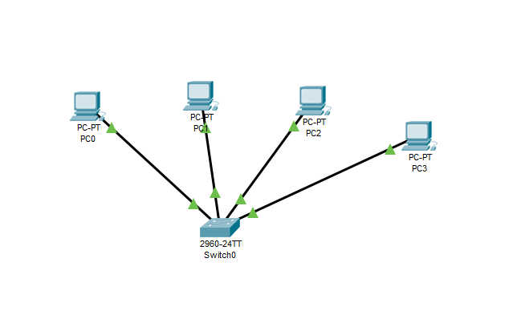 

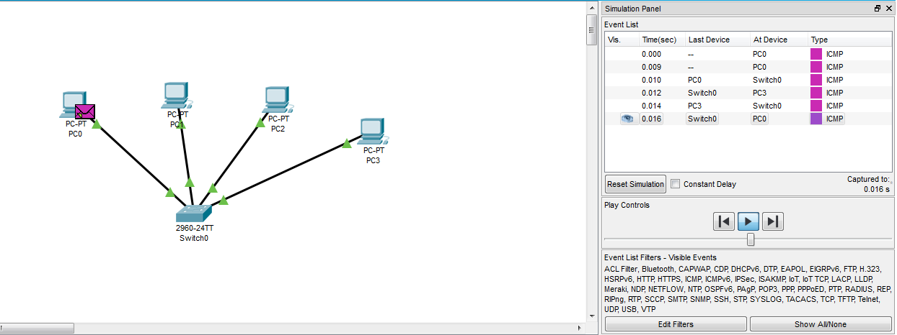     

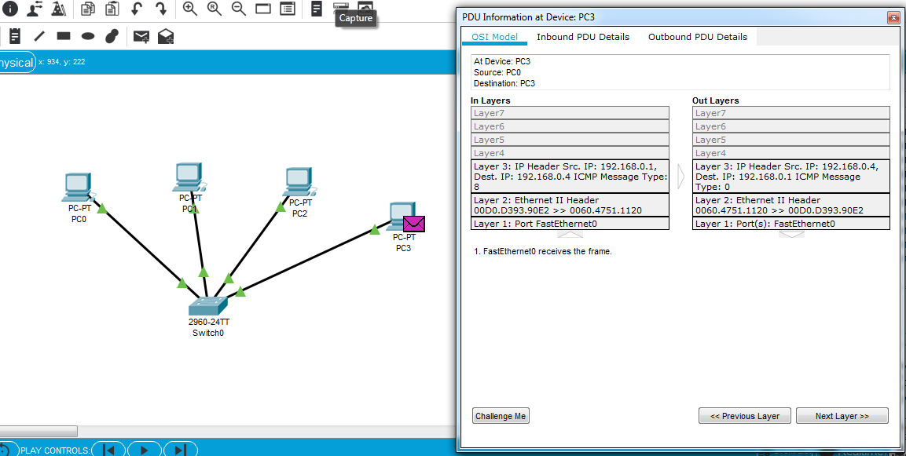 

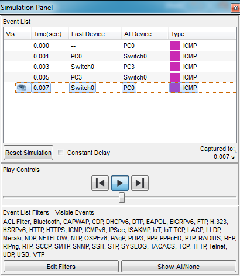     

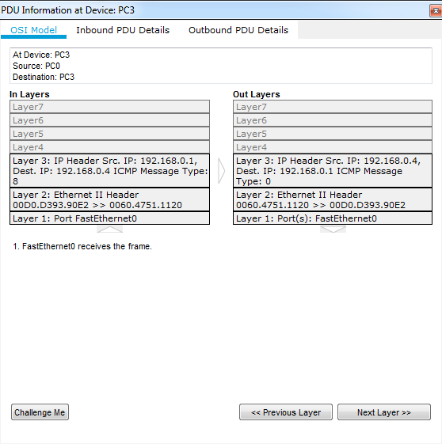 

Expand the project to 8 PCs such as PC-PT, 2 switches (Switch).
Each computer must be connected to the switch with a twisted pair (Copper Straight-through), the switches are connected with each other via a cross cable (Copper Cross-over).

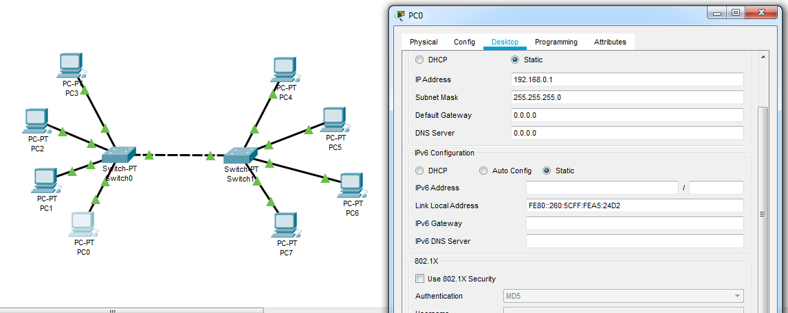 

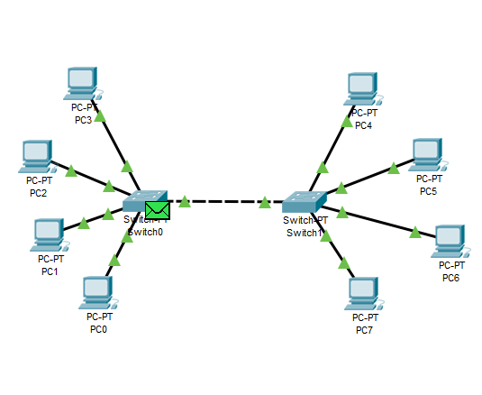  

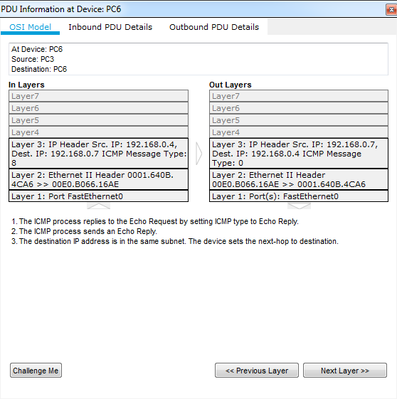 

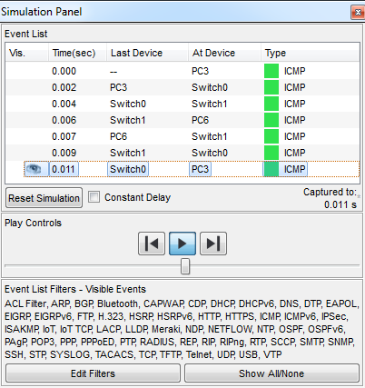 

Divide the existing network into two subnet levels. And connect them using a Router-PT router with multiple ports. Connect the router and switches together using fiber (Fiber).

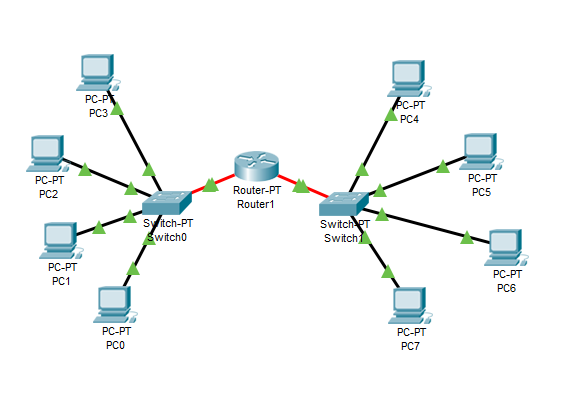 

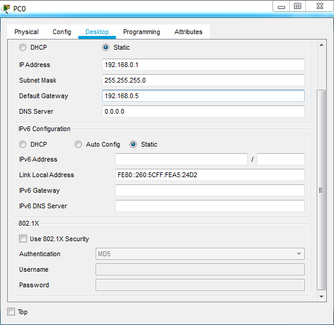 

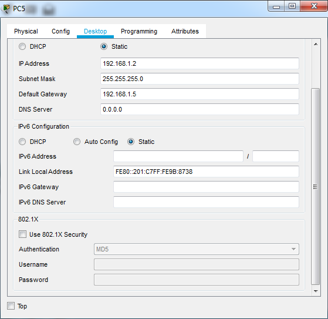     

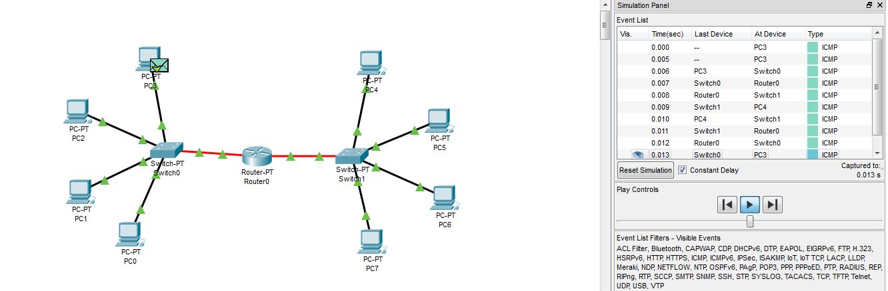
