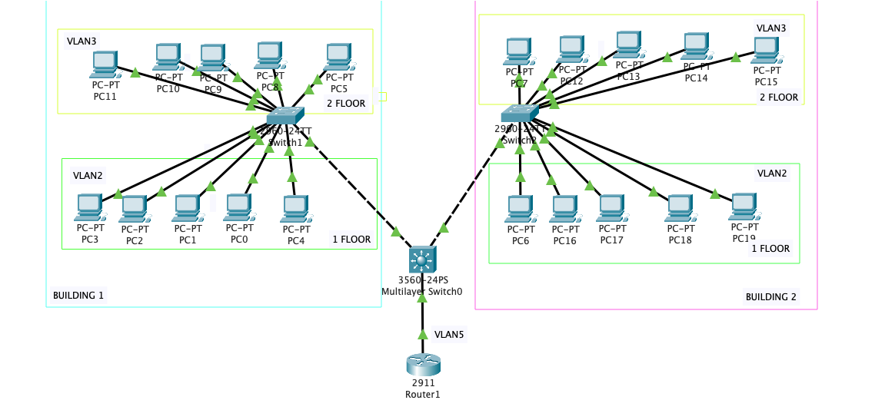
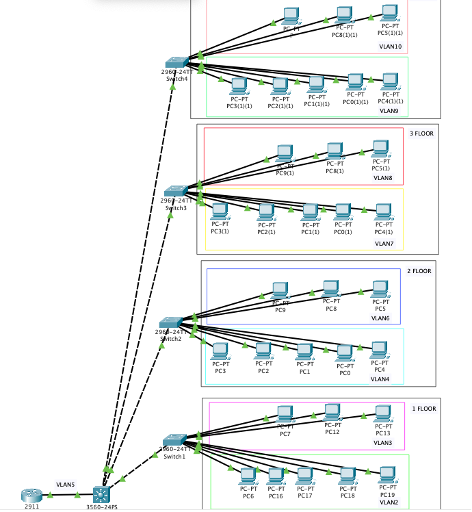
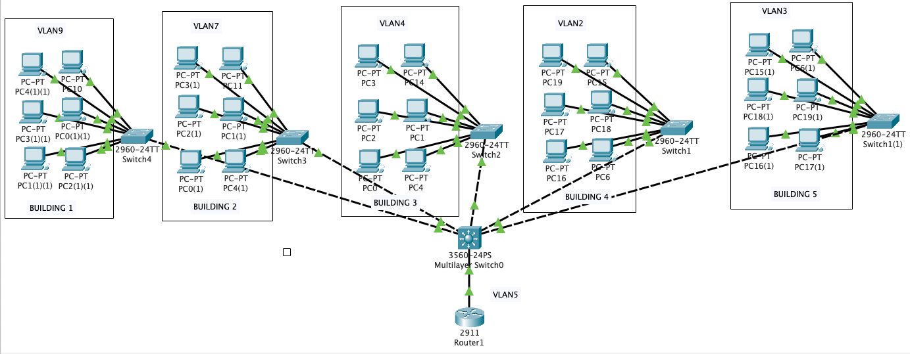

# TASK 4.2.

### Subtask 1.

It is necessary to model the corporate network of the organization, which contains 2 houses with 2 floors in each. 
The horizontal subsystem of the floor consists of one working group of 5 computers.
To analyze the performance of the network and its traffic.  

  

### Subtask 2.

It is necessary to model the corporate network of the organization, which contains 1 house with four floors. 
The horizontal subsystem of the floor consists of two working groups of 3 and 5 computers, respectively.
Carry out logical structuring of the network into 8 subnets (according to the number of working groups).  

 

### Subtask 3.

It is necessary to model the local network of a complex of 5 one-storey buildings. 
One building - 1 working group of 6 computers. The network is based on a router with one port.

 
