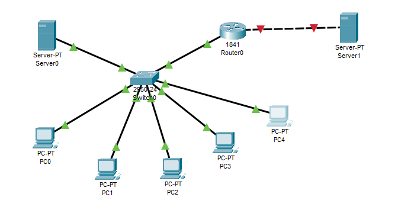
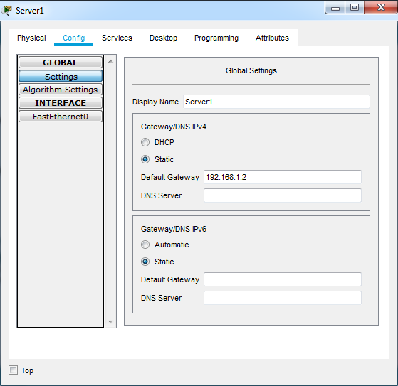
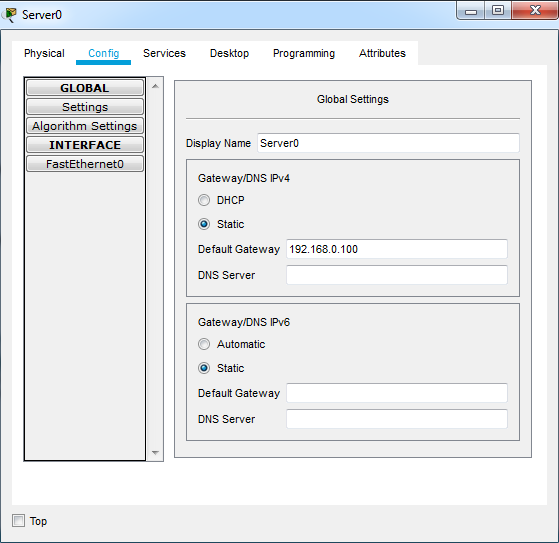
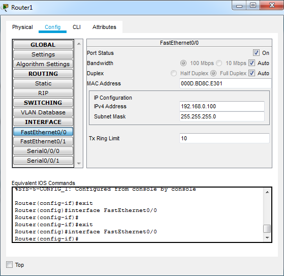
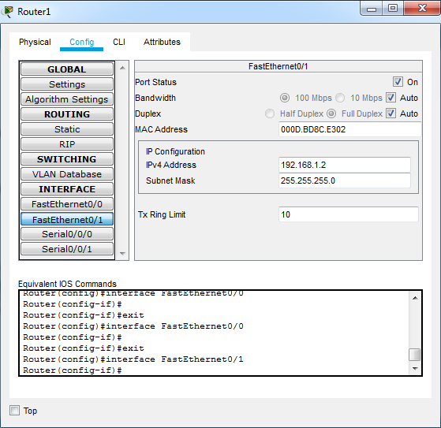
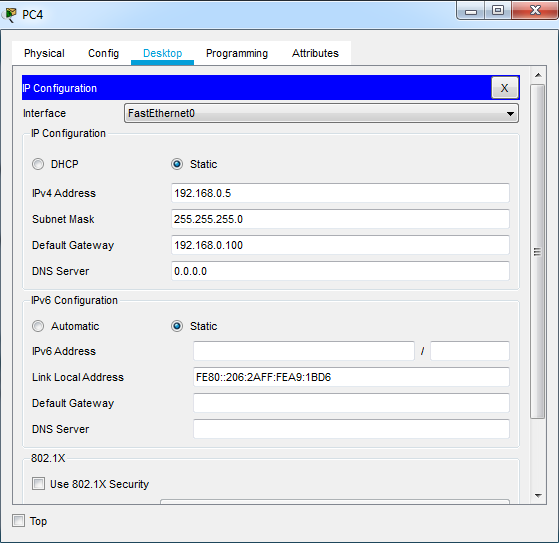
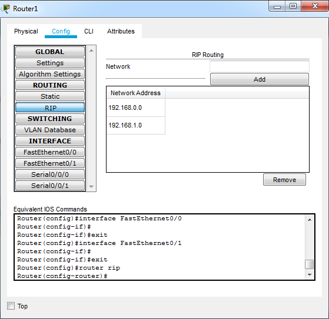
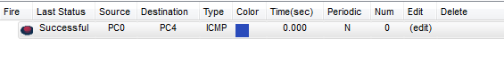
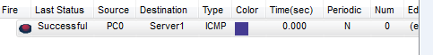
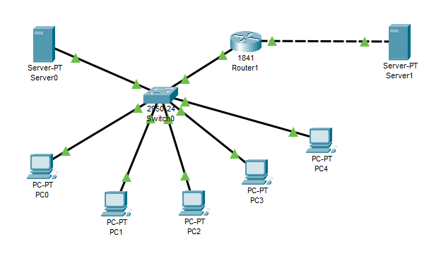

# TASK 4.3.

Build a local area network consisting of a segment based on a switch of 5 computers and a server. The switch is connected to a router to which the server is also connected.
You must specify static IP addresses for the network interfaces of routers, local computers, and servers. Configure RIP routing.
Achieve the ability to transfer ICMP data between all network objects.

  

Set the appropriate ip addresses on the interfaces of the router, computers and server.

 

 

To configure RIP routing, open the Config tab in the router properties window and select RIP.

  

Checking the availability of nodes in the network.

 

     

 
