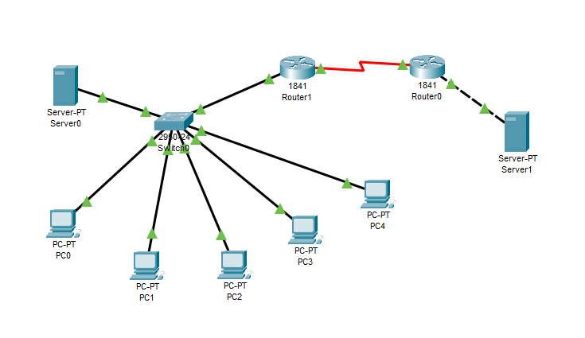
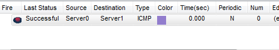
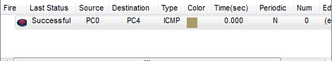
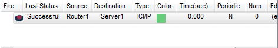
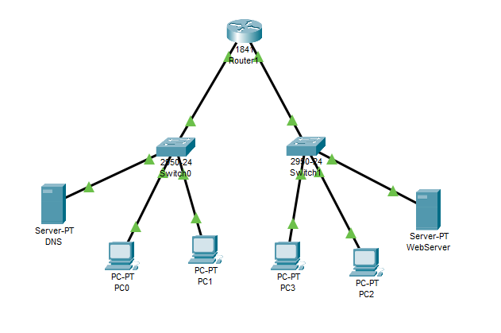
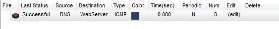
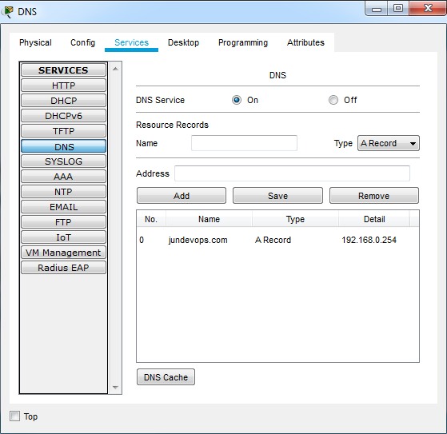
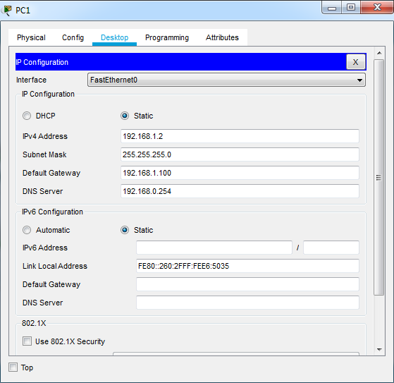
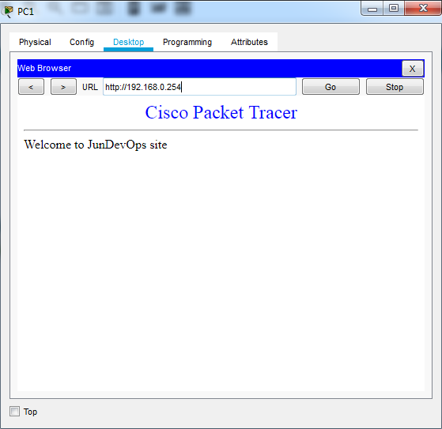
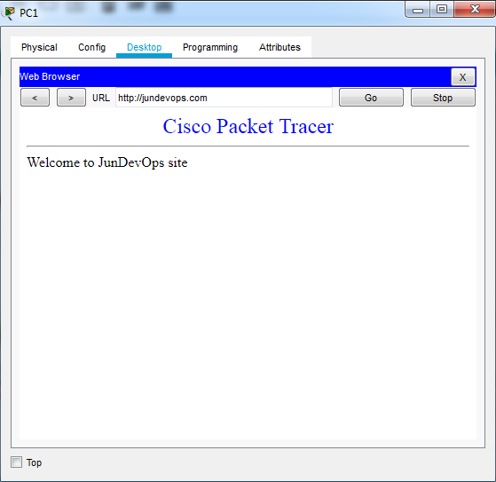

# TASK 4.4.

### Subtask 1.

Add a router to your existing network so that there are at least two of them in the network. And you need to configure traffic between the two networks.

  

 

  

 

### Subtask 2.

Organize 2 subnets. Configure DNS on servers.

  

 

  

 

 

 
