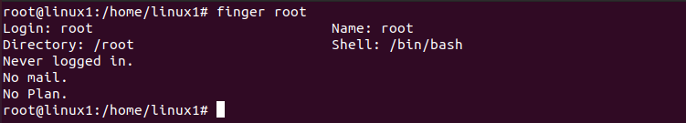
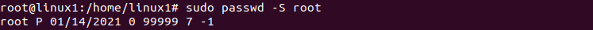

# PART 1. Using commands: passwd, finger, more, less, ls. Fimiliarity with help system, man and info commands.

#### Log in to the system as root.
#### Use the passwd command to change the password. This command changes shadow file which in /etc directory.
  
  

#### To determine the users registered in the system we have to list file shadow in /etc directory.
#### The /etc/passwd file is a text-based database of information about users that may log into the system or other operating system user identities that own running processes.

  
  

#### Additional information for root can be gleaned from the command execution.
The fields, in order from left to right, are:  

1. User name: the string a user would type in when logging into the operating system: the logname. Must be unique across users listed in the file.  

2. x: Information used to validate a user's password; in most modern uses, this field is usually set to "x" (or "*", or some other indicator) with the actual password information being stored in a separate shadow password file.  

3. 0: user identifier number, used by the operating system for internal purposes. It need not be unique.  

4. 0: group identifier number, which identifies the primary group of the user; all files that are created by this user may initially be accessible to this group.  

5. root: Gecos field, commentary that describes the person or account. Typically, this is a set of comma-separated values including the user's full name and contact details.  

6. /root: Path to the user's home directory.  

7. /bin/bash: Program that is started every time the user logs into the system. For an interactive user, this is usually one of the system's command line interpreters (shells).

#### Read the documentation for the finger command.  

 
 


#### Command: ```finger```  

Displays a single line of information about each of the people who are logged in. The columns are:  

•	Login: The user account name of the person who is logged in.  

•	Name: The full name of the person, if this is known to the system.  

•	Tty: The type of terminal they are logged in at. This will usually be a pts (a pseudo-teletype). “:0” means the physical keyboard and screen connected to the computer.  

•	Idle: The idle time of the user. If it is a single digit, it means minutes. If a colon is present, it means hours and minutes, and if a “d” is present, it means days and hours.  

•	Login Time: The time the person logged in.  

•	Office: This is a historical hangover. It was used to display the name or number of the room in which the person worked. This is very rarely set up by root nowadays. Instead, finger will display the ip address of the machine the user has logged in from.  “:0” means the physical keyboard and screen connected to the computer.  

•	Office Phone: This is another legacy item. If root hasn’t recorded the office phone number for a person, it will show a blank.  

#### Change personal information about yourself and describe in plans that you are working on laboratory work 1. 

 
 


#### Become familiar with the Linux help system and the man and info commands. Get help on the previously discussed commands, define and describe any two keys for these commands.
#### Example 1.  

``` sudo passwd –S root ```  

Command passwd with key S checks the status of the password for root user account.

 
 

Here, we see the user's name (root), followed by a P, indicating that his password is currently valid and usable. The password was changed on January 14, 2021. Root can change his password as many times as he wants (0) days, and must change the password every 99999 days. Warning period and inactivity period for password.

#### Example 2.  

Finger command with -l and -s keys for root and linux1 user.

``` finger -l root ```  

``` finger -s root ```

 
 

#### Explore the ```more``` and ```less``` commands using the help system. View the contents of files .bash* using commands.  

 
 
 
 

``` More ``` is a *nix command line used to display the contents of a file in a console. The basic usage of more command is to run the command against a file as shown below:

```more .bash_history```

In order to navigate through the file line by line press ```Enter``` key or press ```Spacebar``` key to navigate one page at a time, the page being your current terminal screen size. To exit the command just press ```q``` key.

 

A useful option of more command is the ```-number``` switch which allows you to set the number of line a page should contain. As an example display the ```.bash_history``` file as a page of 10 lines:

```more -10 .bash_history```

 

Also, you can display a page starting from a specific line number using the ```+number``` option as illustrated below:

```more +7 .bash_history```

 

Similar to ```more```, ```less``` command allows you to view the contents of a file and navigate through file. The main difference between ```more``` and ```less``` is that ```less``` command is faster because it does not load the entire file at once and allows navigation though file using page ```up/down``` keys.

You can navigate through the file line by line pressing ```Enter``` key. Page navigation can be handled with ```spaceba```r key. The page size is represented by your current terminal screen size. To exit command type ```q``` key, same way as for more command.  

```less .bash_history```

 

In order to display a file staring at a specific line number use the following syntax:  

```less +5 .bash_history```

 

If you need to track down the number of every line with ```less``` command use the -N option.  

```less -N .bash_history```

 


#### List the contents of the home directory using the ls command, define its files and directories. Hint: Use the help system to familiarize yourself with the ls command.

 

 

 

 
