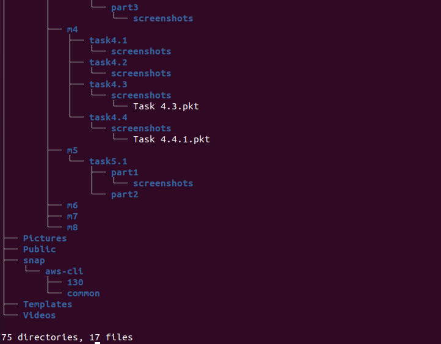
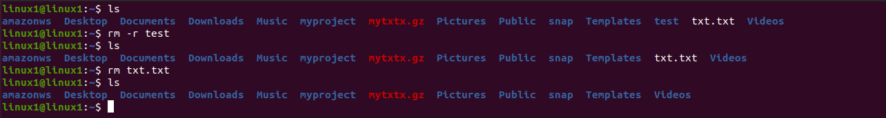

# PART 2. Using commands: tree, file, ls. Fimiliarity with commands find, grep, locate.

### 1. Examine the tree command. Master the technique of applying a template, for example, display all files that contain a character c, or files that contain a specific sequence of characters. List subdirectories of the root directory up to and including the second nesting level. 

The tree is a tiny, cross-platform command-line program used to recursively list or display the content of a directory in a tree-like format. It outputs the directory paths and files in each sub-directory and a summary of a total number of sub-directories and files.

#### Here is a list of some options supported by the tree program: ####

  *Listing options*
  
  -a            All files are listed.
  
  -d            List directories only.
  
  -l            Follow symbolic links like directories.
  
  -f            Print the full path prefix for each file.
  
  -x            Stay on current filesystem only.
  
  -L level      Descend only level directories deep.
  
  -R            Rerun tree when max dir level reached.
  
  -P pattern    List only those files that match the pattern given.
  
  -I pattern    Do not list files that match the given pattern.
  
  --ignore-case Ignore case when pattern matching.
  
  --matchdirs   Include directory names in -P pattern matching.
  
  --noreport    Turn off file/directory count at end of tree listing.
  
  --charset X   Use charset X for terminal/HTML and indentation line output.
  
  --filelimit # Do not descend dirs with more than # files in them.
  
  --timefmt <f> Print and format time according to the format <f>.
  
  -o filename   Output to file instead of stdout.
  
  *File options*
  
  -q            Print non-printable characters as '?'.
  
  -N            Print non-printable characters as is.
  
  -Q            Quote filenames with double quotes.
  
  -p            Print the protections for each file.
  
  -u            Displays file owner or UID number.
  
  -g            Displays file group owner or GID number.
  
  -s            Print the size in bytes of each file.
  
  -h            Print the size in a more human readable way.
  
  --si          Like -h, but use in SI units (powers of 1000).
  
  -D            Print the date of last modification or (-c) status change.
  
  -F            Appends '/', '=', '*', '@', '|' or '>' as per ls -F.
  
  --inodes      Print inode number of each file.
  
  --device      Print device ID number to which each file belongs.
  
  *Sorting options*
  
  -v            Sort files alphanumerically by version.
  
  -t            Sort files by last modification time.
  
  -c            Sort files by last status change time.
  
  -U            Leave files unsorted.
  
  -r            Reverse the order of the sort.
  
  --dirsfirst   List directories before files (-U disables).
  
  --sort X      Select sort: name,version,size,mtime,ctime.
 

It will display the contents of the working directory recursively showing sub-directories and files, and a summary of the total number of sub-directories and files. You can enable the printing of hidden files using the ```-a``` flag.

```tree -a```

To list the directory contents with the full path prefix for each sub-directory and file, use the ```-f``` as shown.

```tree -f```

 You can also instruct tree to only print the subdirectories minus the files in them using the ```-d``` option. 
 
```tree -d``` 

You can specify the maximum display depth of the directory tree using the ```-L``` option. For example, if you want a depth of ```2```, run the following command.

```tree -f -L 2```

 You can also tell the tree to prune empty directories from the output by adding the ```--prun```e option, as shown.
 
```tree -f --prune```

To display only those files that match the wild-card pattern, use the ```-P``` flag and specify your pattern. In this example, the command will only list files that match ```*s*```,```*c*```,```*ss*```.

```tree –P ‘*s*’```

```tree –P ‘*s*’ --prune```

```tree –P ‘*c*’ --prune ```

```tree –P ‘*ss*’ --prune```


  
  
  
  
  
  

You can specify the maximum display depth of the directory tree using the ```-L``` option. For example, if you want a depth of 2, run the following command.

```tree -d -L 2```

  
  

You can also print the size of each file in bytes along with the name using the ```-s``` option. To print the size of each file but in a more human-readable format, use the ```-h``` flag and specify a size letter for kilobytes (K), megabytes (M), gigabytes (G), terabytes (T), etc..

```tree -h```

To display the date of the last modification time for each sub-directory or file, use the ```-D``` options as follows.

```tree -f -pug -h -D```


### 2. What command can be used to determine the type of file (for example, text or binary)? Give an example. 

To determine the file type in Linux, we can use the ```file``` command. This command runs three sets of tests: the filesystem test, magic number test, and language test. The first test that succeeds causes the file type to be printed. 

  

For example, if a file is a text file, it will be recognized as ASCII text.
Here are a couple of examples:

  

### 3. Master the skills of navigating the file system using relative and absolute paths. How can you go back to your home directory from anywhere in the filesystem? 

**Absolute** and **relative** paths

An absolute or full path points to the same location in a file system, regardless of the current working directory. To do that, it must include the root directory. By contrast, a relative path starts from some given working directory, avoiding the need to provide the full absolute path.

  

**PWD** - /home/linux1/myproject

**Absolute path**  
cd /home/linux1/myproject/DevOps_online_Kiev_2020Q42021Q1  
**Relative path**  
cd DevOps_online_Kiev_2020Q42021Q1  

**Absolute path**  
cd /home/linux1/myproject/DevOps_online_Kiev_2020Q42021Q1/Final_Project  
**Relative path**  
cd DevOps_online_Kiev_2020Q42021Q1/Final_Project    

**Absolute path**                                                         
cd /home/linux1  
**Relative path**  
cd ..    

**Absolute path**                                                         
cd /home/ linux1/myproject/DevOps_online_Kiev_2020Q42021Q1          
**Relative path**  
cd ~ /myproject/DevOps_online_Kiev_2020Q42021Q1     

**```cd ~```  -  this command can get you back to home directory from anywhere in the filesystem.** 

### 4. Become familiar with the various options for the ls command. Give examples of listing directories using different keys. Explain the information displayed on the terminal using the ```-l``` and ```-a``` switches.

**Linux Basic ls Commands**
When listing directory contents, the results can be sorted based on several criteria such as alphabetical order of filenames, modification time, access time, version and file size. Sorting using each of these file properties can be enabled by using a specific flag.

Running ls command without appending any argument will list current working directory contents.  

```ls``` 

  

To list contents of any directory, for example /etc directory use:  

```ls /bin/```

  

A directory always contains a few hidden files (at least two), therefore, to show all files in a directory, use the ```-a``` or ```--all``` flag:  

```ls -a```

  

You can as well print detailed information about each file in the ls output, such as the file permissions, number of links, owner’s name and group owner, file size, time of last modification and the file/directory name.
This is activated by the ```-l``` option, which means a long listing format as in the next screenshot:

```ls -l```

  

To list files in a directory and sort them last modified date and time, make use of the ```-t``` option as in the command below:

```ls -lt``` 

  

6. If you want a reverse sorting files based on date and time, you can use the ```-r``` option to work like so:

```ls -ltr```

  

We can create an alias for long format listing ```ls -alF``` as ```ll``` or ```ls -A``` as ```la``` …
We need to add alias to .bashrc file.

  

### 5. Perform the following sequence of operations.

Create a subdirectory in the home directory. In this subdirectory create a file containing information about directories located in the root directory (using I/O redirection operations) and view the created file.

```mkdir test && ls / > ~/test/txt.txt && cat ~/test/txt.txt```

  

Copy the created file to your home directory using relative and absolute addressing.

Here are 3 options how to copy created file.

  
 
  
 
  

Delete the previously created subdirectory with the file and delete the file copied to the home directory.

  

### 6. Perform the following sequence of operations.

Create a subdirectory **test** in the home directory. Copy the **.bash_history** file to this directory while changing its name to **labwork2**.

  

Create a hard and soft link to the **labwork2** file in the **test** subdirectory/

  

**Definition of soft and hard link and their concepts.** 

_What is Soft Link And Hard Link In Linux? A symbolic or soft link is an actual link to the original file, whereas a hard link is a mirror copy of the original file. If you delete the original file, the soft link has no value, because it points to a non-existent file._

Change the data by opening a symbolic link. 

 

Data in original file was chenged.

 
 
Rename the hard link file to **hard_lnk_labwork2*** and the soft link file to **symb_lnk_labwork2**;
Delete the **labwork2**.

 

Soft link doesn’t work. 
Hard link still works. A hard link is simply an alternative name for the same inode (file).

### 7. Using the locate utility, find all files that contain the squid and traceroute sequence. 

Linux, like almost any other operating system, utilizes several mechanisms to answer search queries for users. Two of the most popular file searching utilities accessible to users are called find and locate.

 

### 8. Determine which partitions are mounted in the system, as well as the types of these partitions. 

```cfdisk```

Cfdisk is a linux partition editor with an interactive user interface based on ncurses. It can be used to list out the existing partitions as well as create or modify them.

 

```parted -l```

Parted is yet another command line utility to list out partitions and modify them if needed.

 

```df```

Df is not a partitioning utility, but prints out details about only mounted file systems. The list generated by df even includes file systems that are not real disk partitions.

 

```df -aTh```


 

```lsblk```

Lists out all the storage blocks, which includes disk partitions and optical drives. Details include the total size of the partition/block and the mount point if any.
Does not report the used/free disk space on the partitions.
If there is no MOUNTPOINT, then it means that the file system is not yet mounted. For cd/dvd this means that there is no disk.

 

```lsblk -f```

 

### 9. Count the number of lines containing a given sequence of characters in a given file. 

```wc -l```

 

### 10. Using the find command, find all files in the /etc directory containing the host character sequence. 

 

### 11. List all objects in /etc that contain the ss character sequence. How can I duplicate a similar command using a bunch of grep? 

 

 

### 12. Organize a screen-by-screen print of the contents of the /etc directory. Hint: You must use stream redirection operations. 

 

 

### 13. What are the types of devices and how to determine the type of device? Give examples. 

```ls –l /dev```

 

In the ls command you can see the type of file with the first bit on each line.

***Device files are denoted as the following:***  
**•	c - character  
•	b - block  
•	p - pipe  
•	s - socket**  

**Character Device**
These devices transfer data, but one a character at a time. You'll see a lot of pseudo devices (/dev/null) as character devices, these devices aren't really physically connected to the machine, but they allow the operating system greater functionality.

**Block Device**
These devices transfer data, but in large fixed-sized blocks. You'll most commonly see devices that utilize data blocks as block devices, such as harddrives, filesystems, etc.

**Pipe Device**
Named pipes allow two or more processes to communicate with each other, these are similar to character devices, but instead of having output sent to a device, it's sent to another process.

**Socket Device**
Socket devices facilitate communication between processes, similar to pipe devices but they can communicate with many processes at once.

### 14. How to determine the type of file in the system, what types of files are there? 

##### Type of Files in Linux. #####

Totally 7 types of files are available in Linux with 3 Major categories.  
**•	Regular File  
•	Directory File  
•	Link File  
•	Character Device File  
•	Socket File  
•	Named Pipe File  
•	Block File**  

The ls command helps you to identify and classify all kind of the file types found on a Linux system.

**Regular file**
The regular file is a common file type found everywhere on Linux system. These include text files, script files, images, binary files, and shared libraries,etc.
**“-”** This refers to the identification symbol for the regular file. You can use the rm command to remove a regular file.

```ls -la | grep ^-```

**Directory**
The directory is the second most common file type found on a Linux system. This can be created with the mkdir command.

```ls -la | grep ^d```

**Link File**
A link is a mechanism for creating a shortcut to the original file or directory. It contains information about another file or directory.
Links allow more than one filename to reference the same file.
There are two types of link files available, it’s soft link and hard link.

```ls -la | grep ^l```

**Character Device file**
Character device files allow the user and application program to communicate directly with the hardware device. It’s not allow programs to read or write single characters at a time.
It is available under the /dev directory.

```ls -la | grep ^c```

**Block Device file**
Block devices provide buffered access to hardware devices, it’s similar to character devices. Unlike character devices, block devices will always allow the programmer to read or write a block of any size at a time.

```ls -la | grep ^b```

**Socket file**
A socket is a special file used for inter-process communication, which enables communication between two processes.

```ls -la | grep ^s```

**Named Pipe file (FIFO)**
a named pipe (also known as a FIFO) is one of the methods for inter-process communication.
Named pipes are special files that can exist anywhere in the file system. They can be created with the command mkfifo.
A named pipe is marked with a p as the first letter of the mode string.

```ls -la | grep ^p```

### 15. List the first 5 directory files that were recently accessed in the /etc directory.

```tree -cDr```

-c            Sort files by last status change time.  
-r            Reverse the order of the sort.  
-D            Print the date of last modification or (-c) status change.  


The same command with depth-level 1.

 

Option with ```ls``` command.

```ls -alt```

 

Option with ```find``` command.

```sudo find . -type f -cmin -250 -ls```

 


 

