 
### 1. Analyze the structure of the **/etc/passwd** and **/etc/group** file, what fields are present in it, what users exist on the system? Specify several pseudo-users, how to define them? 

**What fields are present in/etc/passwd file?** 
File structure etc/passwd.  

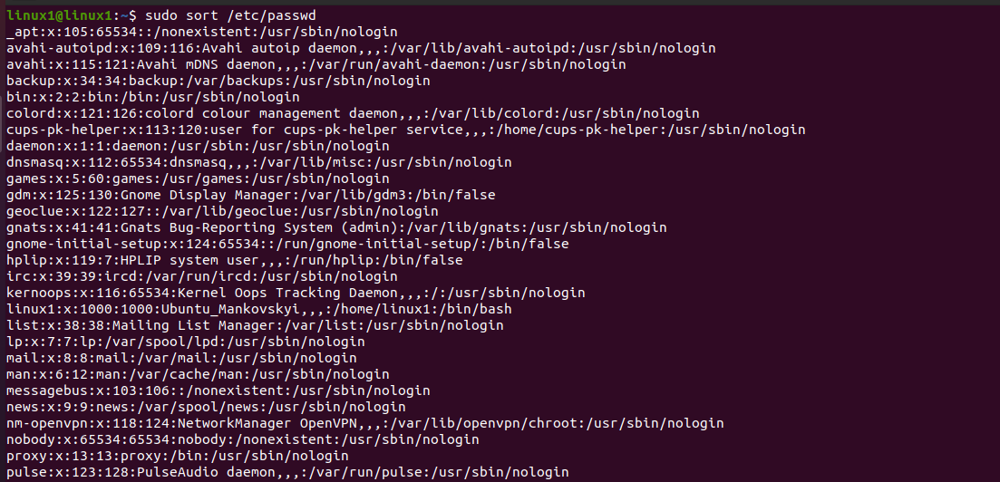
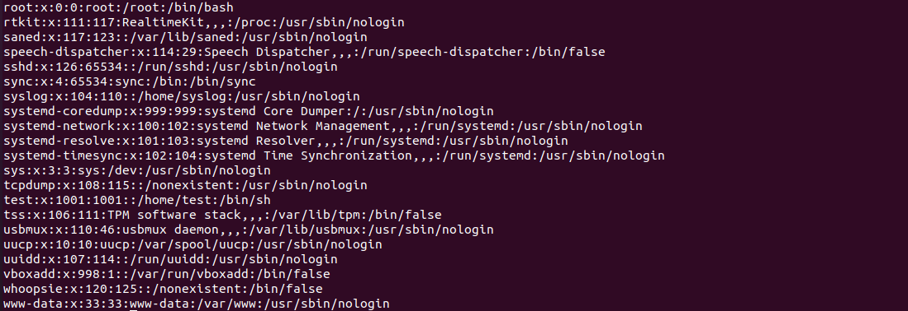
 
This file contains lines of the following form, separated by colons:    

**username: pswd: uid: gid: uid comments: directory: shell**  

Where:   
**username** – username;  
**pswd** – password;  
**uid** - unique identifier of the user within the system;  
**gid** - unique identifier of the group within the system to which the user belongs;  
**uid comments** - comment, extended user description, for example, full name;   
**directory** - user's home directory;  
**shell**- program name - the user's command interpreter.  

The username must not contain a colon character. In addition, it is not recommended to use a period (.) In a name, or start it with + or -.   
The password field can be empty, indicating that no password is required to register a user. It can also contain not more than 13 characters of the encrypted version of the password.   

uid is a simple numeric designation for an individual user. This is usually a positive number not more than 65535 (sometimes 32-bit). 

**What users exist on the system?**    
0 (root),   
1-999(daemons, pseudo-users, system and reserved users),   
1000+ (regular users).  

**Specify several pseudo-users, how to define them?**    
**Pseudo-users.** Each of the UNIX variants contains pseudo-user description lines in the password file.These descriptions are never edited.Users of these names are not registered in the system and are only needed to confirm ownership of the processes.

**The most used are:**  
**daemon** – Used by system service processes;  
**bin** – Gives ownership of executables command  ;
**adm** – Owns registration files;  
**nobody** – Used by many services;  
**sshd** – used by the secure shell server.  

To define UID of pseudo-users we can list the **/etc/passwd**. Name of pseudo-users is present in first colomn and theirs UID in third colomn (should be from 1 to 999).

**What fields are present in/etc/group file? **

**File structure etc/group. **  

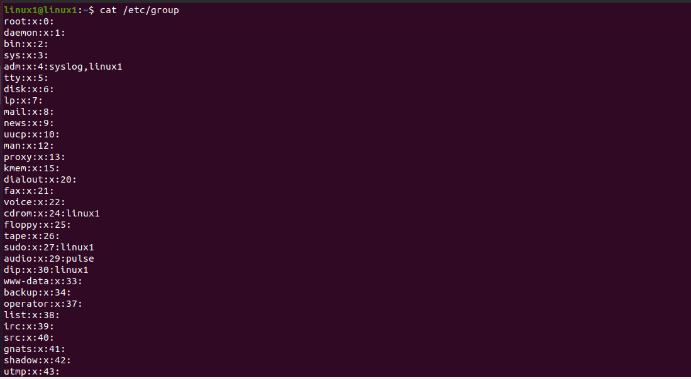
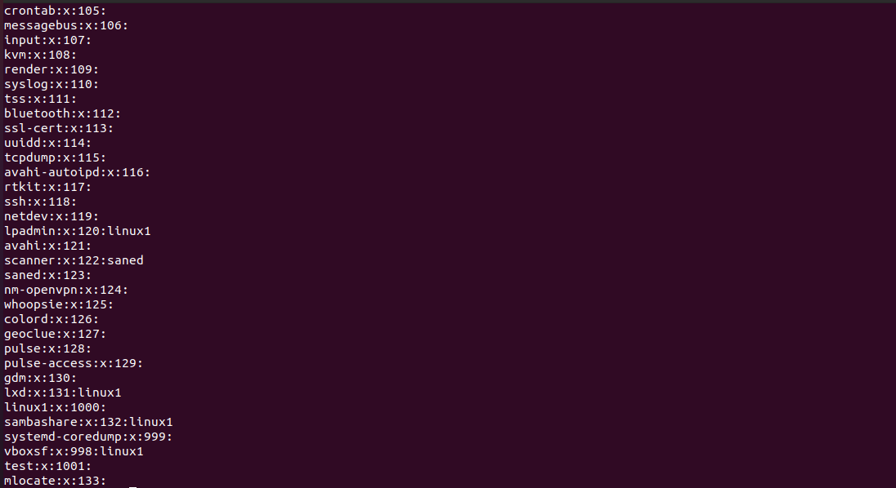     


The /etc/group file applies to the general security scheme for Unix-like systems: user, group, and file access.   

The format for this file is as follows:  
 
**group_name:password:group_id:list** 

The **group_name** field contains the text name for the group. 
The **password** field contains the encrypted password of this group. If this field is empty, than tou no need password required. 
The **group_id** field contains a unique identifier for this group. 
The **list** field contains a comma separated list of users belonging to this group. Users do not need to be included in the list of those groups that are specified as their primary in the **/etc/passwd** file.

### 2. What is UID? What are the uid ranges? How to define it?

**UID** - unique identifier of the user within the system.  

**UID** is a simple numeric designation for an individual user. This is usually a positive number not more than 65535 (sometimes 32-bit). 

**The UID ranges are: **
0 (root),   
1-999 (daemons, pseudo-users, system and reserved users),   
1000+ (regular users).  

To define UID we can list the **/etc/passwd** (UID presents in third colomn).

### 3. What is GID? How to define it?

**GID** - unique identifier of the group within the system to which the user belongs.  

To define GID we can list the /etc/passwd (GID presents in fourth colomn) or list
the /etc/group (GID presents in third colomn).  

### 4. How to determine belonging of user to the specific group?

We can list the **/etc/group** file or type ```getent group``` command.
First colomn shows us a **group name** and the fourth colomn is the** list** field contains a comma separated list of users belonging to this group.  

****Another options to to determine belonging of user to the specific group are: ****

```group [username] ```
or 
```id [username]```

Output of these commands show us a list of all groups a specific user belongs to.

### 5. What are the commands for adding a user to the system? What are the basic parameters required to create a user? 

****The main commands for adding user to the system are: ****

1.	```adduser [username]``` ( is a perl script which uses ```useradd``` binary in back-end)

****This command creates:****  
-	User;  
-	User group;  
-	Home directory;  
-	Asks for password;  
-	Asks some user info (Full name, Room number, Work phone, Home phone, Other ).    

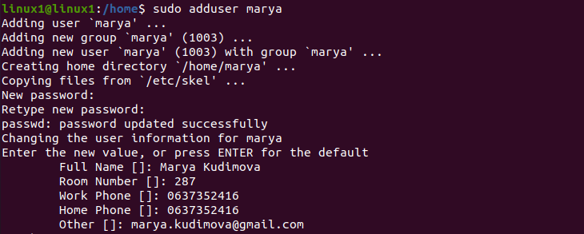     

2.	```useradd [username]``` (is native binary compiled with the system)  
This command creates only user account without any other parameters for user.

****Other mains commands for working with Linux accounts are: ****
```userdel``` - deleting user;    
```usermod``` - move the current home directory to a new location;    
```passwd ``` - add or change user password.    

**The command interface is as follows: ** 
1) useradd [-c uid comment] [-d dir] [-e expire] [-f inactive] [-g gid] [-m [-k skel_dir]] [-s shell] [-u uid [-o]] username   
2) userdel [-r] username   
3) usermod [-c uid comment] [-d dir [-m]] [-e expire] [-f inactive] [-g gid] [-G gid [, gid]] [-l new username] [-s shell] [-u uid [-o]] username  

**The main parameters have the following meanings: **  
  
**username** is the login name of the user. This is the only required parameter in all commands.  
**uid comment** is an additional comment about the user with the specified name.  
**dir** - indicates to the user's home directory.  
**expire** - indicates the exact date until registration record are available.  
**inactive** -indicates a continuous number of days without registration in the system before this record is blocked.  
**gid** - defines the id or name of the group to which the user belongs.  
**new_username** - Replaces the old login name.  
**shell** - defines the shell for the command interpreter for the given user.  
**skel_dir** - contains files which must be copied to the new user's home directory.  
uid is the unique user identifier associated with this name.  

**-m** - ndicates need to create a new home directory (useradd) or move the current one to a new location (usermod).  
**-o** - Allows repeating the same user ID.  
**-g** - Select the main group for the login name.  
**-G** - selects additional groups.  
**-r** -Tells the user's home directory to be moved. If the home directory for the registration entry is out of date, existing files will be migrated to the new directory.  

**The format of Password change command passwd this:**  

**passwd[-k] [-l] [-u [-f]] [-d] [-S] [username] **

**The main parameters have the following meanings:**  
**-k** - used to update only those passwords that have expired.  
**-l** - blocks the specified user (available only to the administrator).   Blocking is performed by adding the ! Prefix to the password.  
**stdin** - accept new password from standard input.  
**-u** - unblock user and remove prefix! (available only to the administrator).  
**-d** - cancel the password for the user (available only to the administrator). Allows the user to log in without a password and change it themselves.  
**-n** - sets the minimum period in days before changing the password (available only to the administrator).  
**-x** - sets the maximum period in days before changing the password (available only to the administrator).  
**-w** - sets the period in days when the user starts receiving messages about the need to change the password (available only to the administrator).  
**-i** - sets the period in days until the old password is no longer active and the registration record is blocked (available only to the administrator).  
**-S** -displays short information about the state of the password (about its validity period). Available only to the administrator.

### 6. How do I change the name (account name) of an existing user? 

To change the name of an existing user we should use command ```usermod``` with key ```[-l new username old username]```  

For example: rename **masha** into **anton**.  
   
```usermod –l anton masha```  
  
After renaming user saved current UID 1002.

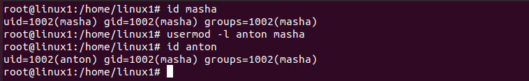     

### 7. What is skell_dir? What is its structure? 

Directory **/etc/skel/** (skel is derived from the “skeleton”) is used to initiate home directory when a user is first created. A sample layout of “skeleton” user files is as shown below:  
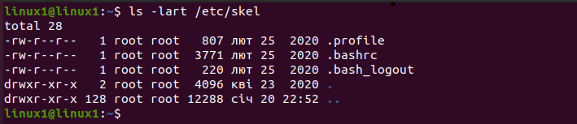    
 
Here is sample **/etc/defualt/useradd** file which defines the skel directory.   

By default useradd file has 8 values.  

```SHELL=/bin/sh```
```GROUP=100```
``````HOME=/home```
```INACTIVE=-1```
```EXPIRE=```
```SKEL=/etc/skel```
```CREATE_MAIL_SPOOL=yes```

But in my case, I have only one uncommented value by default - **SHELL=/bin/sh**.  
See the screenshot below.

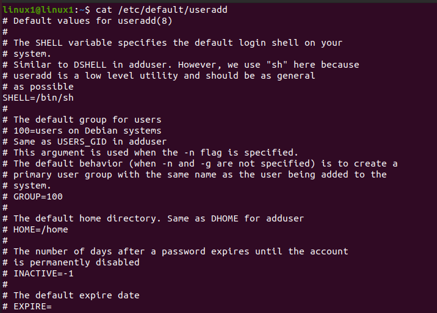  
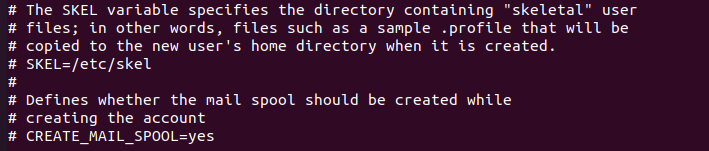     
     


### 8. How to remove a user from the system (including his mailbox)? 

In most Linux distributions, when removing a user account with ```userdel```, the user **home** and **mail spoo**l directories are not removed.  

We should use the ```-r``` (--remove) option to force ```userdel``` to remove the user’s home directory and mail spool:  

```userdel -r username```  

### 9. What commands and keys should be used to lock and unlock a user account? 

To lock a users account use the command:  
```usermod –L```   
 or  
```passwd –l```    

Both the commands adds an exclamation mark [!] in the second field of the file **/etc/shadow**.  

For example:  

```passwd -l [username]```  

```-l``` - blocks the specified user (available only to the administrator).  
Blocking is performed by adding the **!** prefix to the password in the **shadow file** or by adding **L** letter to the second field in **passwd file**  

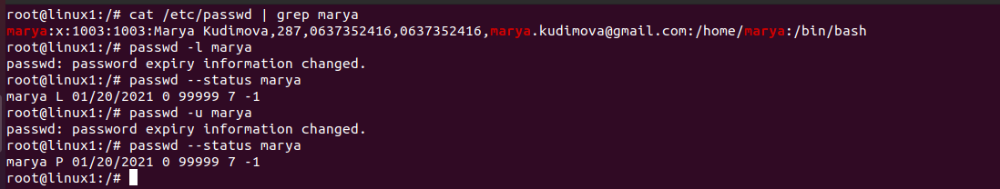     

To check is the user locked or not use the command:  

```passwd --status [username]```  


To unblock user use command:  

```passwd -u [username]```  

```-u``` - unblock user and remove prefix **!** (available only to the administrator).

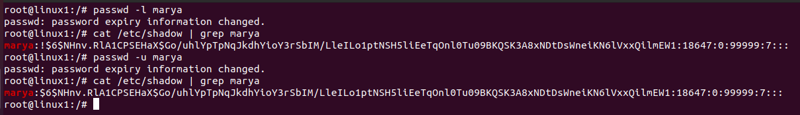     
  

### 10. How to remove a user's password and provide him with a password-free login for subsequent password change?   

**Command to delete user password under Linux**  
  
Type the following command to delete a user password:  

```passwd --delete [username]```  

or  

```passwd -d [username]```  

Answer after command:  
  
```passwd: password expiry information changed.```  


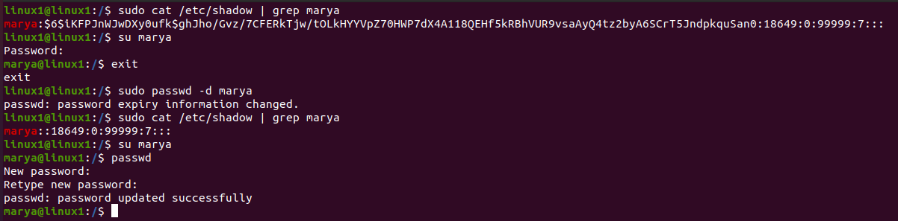     

After that you may type ```passwd [username]``` command and assign a new password.   


### 11. Display the extended format of information about the directory, tell about the information columns displayed on the terminal.   

**Lets take for example the colomns in row number 3 (directory “amazonws” ):**   

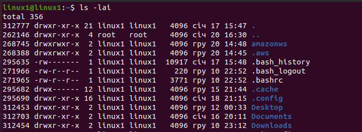        

**1. Inode number (268745)**  
Inode number is a unique identifier for afile in the file system that contains:  
- file type (regular file, directory, etc.);  
- file access rights;  
- information about who owns the file;  
- stamps about the time of creation, modification, last access to the file;  
- file size;  
- pointers to physical blocks on disk belonging to this file –these blocks store the "contents"of the file.  

**2. File permissions (drwxrwxr-x)**  
The first character indicates the file type:  
-	- regularfile;  
d - directory;  
b - blockdevice;  
c - characterdevice;  
l - symboliclink;  
p – pipe (pipe,fifo);  
s - socket.  

Three sets of characters, three times, indicating permissions for owner, group and other:  
•	r = readable  
•	w = writable  
•	x = executable (for files) or accessible (for directories)  

3.**Number of (hard) links (2)**  
  The number of hard links means the number of names the inode has, i.e. links created with ln without the -s option.  

**4. Owner name (linux1)**  

**5 Owner group (linux1)**  

**6. File size in bytes (4096)**  

**7. Time of last modification (Dec 20 14:48)**  

**8. File/directory name (amazonws)  

### 12. What access rights exist and for whom (i. e., describe the main roles)? Briefly describe the acronym for access rights.   

On a Linux system, each file and directory is assigned access rights for the owner of the file, the members of a group of related users, and everybody else. Rights can be assigned to read a file, to write a file, and to execute a file.  

To see the permission settings for a file or dir, we can use 
the ```ls –l [file name]``` command  
or   
```namei –l [path]```.  

Each of 10 characters in sequence are indicate the file type and three sets of three characters that convey the reading, writing and execution permission for the owner, group, and everybody else.  

**Read permission for file (first character) **  
**-	** The file cannot be read.  
**r**	 The file can be read.  

**Write permission for file (second character) **  
**-	** The file cannot be modified.  
**w**	 The file can be modified.  

**Execute permission for file (third character) **  
**-	** The file cannot be executed.  
**x**	 The file can be executed.  
**s**	 The setuid bit when found in the user triad; the setgid bit when found in the group triad; it is not found in the others triad; it also implies that x is set.  
**S**	 Same as s, but x is not set; rare on regular files, and useless on folders.  
**t**	 The sticky bit; it can only be found in the others triad; it also implies that x is set.  
**T** 	Same as t, but x is not set; rare on regular files, and useless on folders.  

### 13. What is the sequence of defining the relationship between the file and the user?   

        

### 14. What commands are used to change the owner of a file (directory), as well as the mode of access to the file? Give examples, demonstrate on the terminal.   

To change the owner of a file (directory) use the ```chown``` command in a terminal.  

Below is the command's general structure:  

```chown [new owner] [filename]```  


To change the group owner of a file (directory) use the ```chgrp``` command in a terminal.  

Below is the command's general structure:  

```chgrp [new group owner] [filename]```  


To verify that the owner of the file has changed type:  

```ls -l [filename]```  

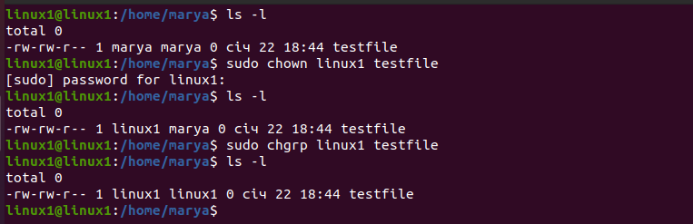    

To change the permissions — or access mode — of a file, use the ```chmod``` command in a terminal.   

Below is the command's general structure:  

```chmod who=permissions [filename]```  

Where who is any from a range of letters, each signifying who is being given the permission. They are as follows:  

```u```: the user that owns the file.  
```g```: the user group that the file belongs to.  
```o```: the other users, i.e. everyone else.  
```a```: all of the above; use this instead of typing ```ugo```.  

```=```: assign operation.  
```+```: add operation.  
```-```: remove operation.  

```r```: read permission.  
```w```: write permission.  
```x```: execute permission.  
```l```: mandatory locking permission, setgid bit is on, group execution bit is off.  
```s```: setuid or setgid bit is on.  
```S```: suid bit is on, user execution bit is off.  
```t```: Sticky bit is on, execution bit for others is on.  
```T```: Sticky bit is on, execution bit for others is off.  

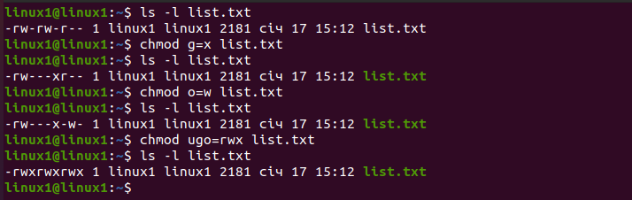    

### 15. What is an example of octal representation of access rights? Describe the umask command.  

**Numeric or octal method**  

```chmod``` can also set permissions using numbers.  

Using numbers is another method which allows you to edit the permissions for all three owner, group, and others at the same time, as well as the setuid, setgid, and sticky bits. This basic structure of the code is this:  

```chmod xxx [filename]```  

Where xxx is a 3-digit number where each digit can be anything from 0 to 7.   
The first digit applies to permissions for owner, the second digit applies to permissions for group, and the third digit applies to permissions for all others.  

In this number notation, the values r, w, and x have their own number value:  

```r=4```  
```w=2```  
```x=1```  

For example, if you want to grant the owner of a directory read write and execution permissions, and you want group and everyone else to have just read and execute permissions, you would come up with the numerical values like so:  

```Owner: rwx=4+2+1=7```  
```Group: r-x=4+0+1=5```  
```Other: r-x=4+0+1=5```  

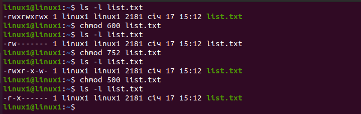      

On Linux and Unix operating systems, all new files are created with a default set of permissions. The umask utility allows you to view or to set the file mode creation mask, which determines the permissions bits for newly created files or directories.  

It is used by mkdir, touch, tee and other commands that create new files and directories.  

**Understanding umask**  

By default, on Linux systems, the default creation permissions are **666** for files, which gives read and write permission to user, group, and others, and to **777** for directories, which means read, write and execute permission to user, group, and others.   
Linux does not allow a file to be created with execute permissions.  

The default creation permissions can be modified using the ```umask``` utility.  

To view the current mask value, simply type ```umask``` without any arguments:  

```umask```  

The output will include the:  

```0002```  

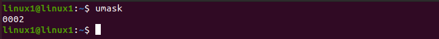        


For example, to calculate how umask 0022 will affect newly created files and directories, use:  

**Files:** 0666 - 0022 = 0644. The owner can read and modify the files. Group and others can only read the files.  

**Directories:** 0777 - 0022 = 0755.The owner can cd into the directory and list read, modify, create or delete the files in the directory. Group and others can cd into the directory and list and read the files.  


### 16.  Give definitions of sticky bits and mechanism of identifier substitution. Give an example of files and directories with these attributes.   

**Set the sticky bit on Directory**  
The example below enables the sticky bit on a directory.  

Use chmod command to set the sticky bit. If you are using the octal numbers in chmod, give 1 before you specify other numbered privileges, as shown below. The example below, gives rwx permission to user, group and others (and also adds the sticky bit to the directory).  

```chmod 1777 [dir]```  

Or, you can assign only sticky bit to an existing directory (without touching any other user, group and other privileges) using chmod command as shown below.  

```chmod +t dir```  

Once the sticky bit is assigned to a directory, you’ll see (t) as the last character in the permission. In this example, it is ```drwxrwxrwt```.  

If you set the sticky bit to a directory, other users cannot delete or rename the files (or subdirectories) within that directory.  

When the sticky bit is set on a directory, only the owner and the root user can delete / rename the files or directories within that directory.  

To remove the sticky bit from a directory, do the following.  

```chmod -t [dir]```  

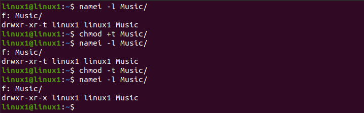           
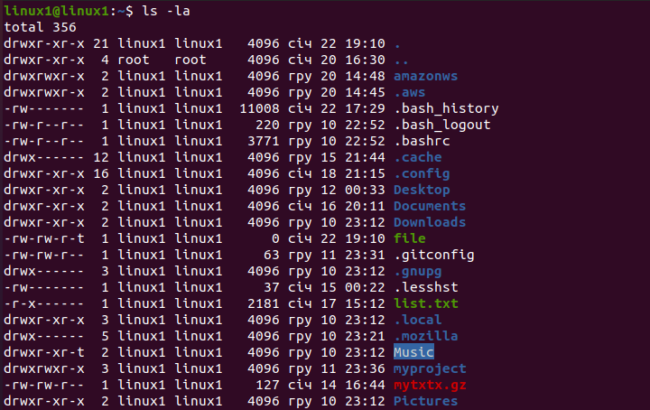           
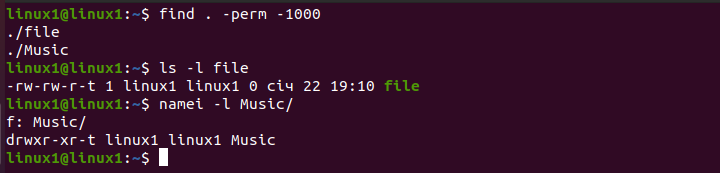           

### 17. What file attributes should be present in the command script?   

Each shell script must have the execute permission.   
Mode can be either a symbolic representation of changes to make, or an octal number representing the bit pattern for the new mode bits.  

Allowing everyone to execute the script, enter:  

```chmod +x script.sh```    

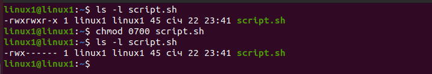           

or  

```chmod 0755 script.sh```    

           


