### Part1
1.How many states could has a process in Linux?
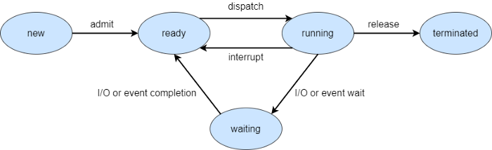

Five-State Process Model States
New/Created: The process that is just being created. The Program Control Block is already being made but the program is not yet loaded in the main memory. The program remains in the new state until the long term scheduler moves the process to the ready state (main memory).
Ready: A process that is waiting to be executed.
Running: The currently executing process.
Waiting/Blocked: Process waiting for some event such as completion of I/O operation, waiting for other processes, synchronization signal, etc.
Terminated/Exit: A process that is finished or aborted due to some reason.

2. Examine the pstree command. Make output (highlight) the chain (ancestors) of the current process.
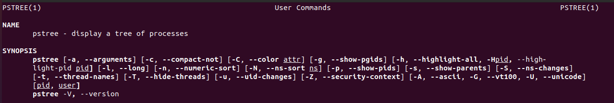

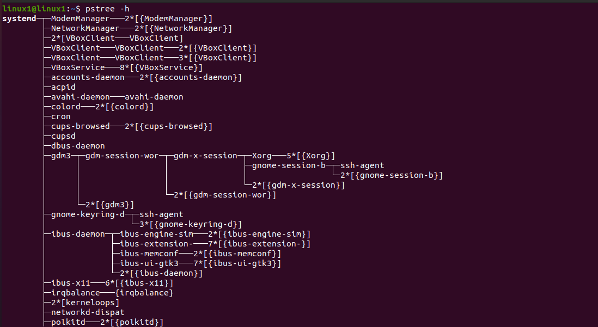
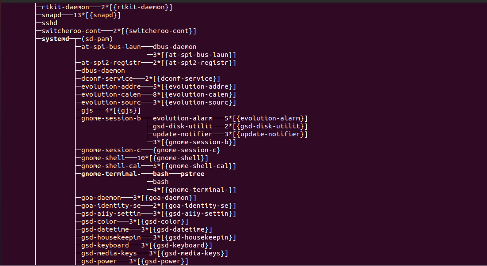
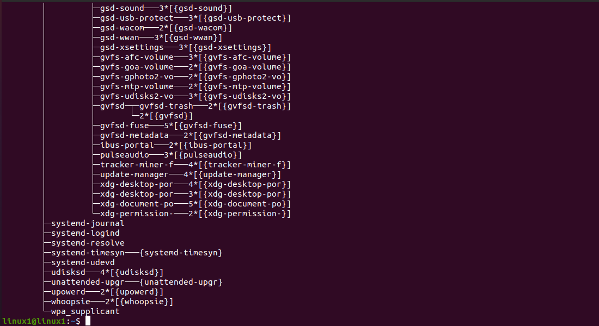

3. What is a proc file system? 
The **proc filesystem (procfs)** is a special filesystem in Unix-like operating systems that presents information about processes and other system information in a hierarchical file-like structure, providing a more convenient and standardized method for dynamically accessing process data held in the kernel than traditional tracing methods or direct access to kernel memory. Typically, it is mapped to a mount point named */proc* at boot time. The proc file system acts as an interface to internal data structures in the kernel. It can be used to obtain information about the system and to change certain kernel parameters at runtime (sysctl).
The contents of the directory looks like this:
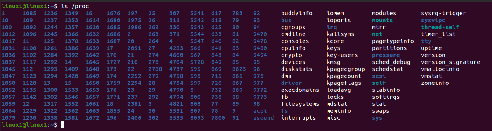

4. Print information about the processor (its type, supported technologies, etc.).
If we would like to find out some info about processor we should cat the file /proc/cpuinfo. Result of execution of that command shows below:
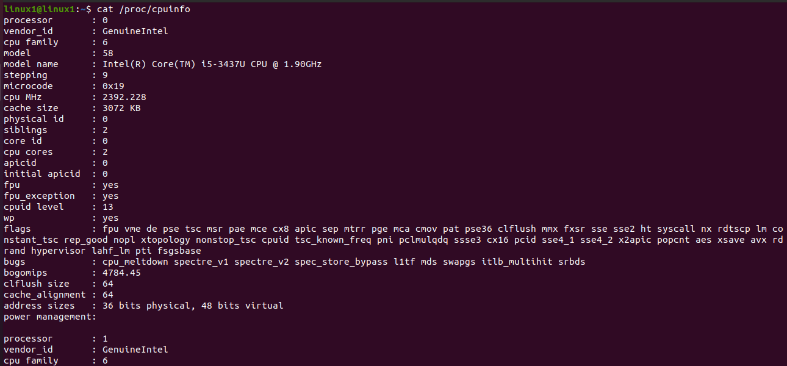
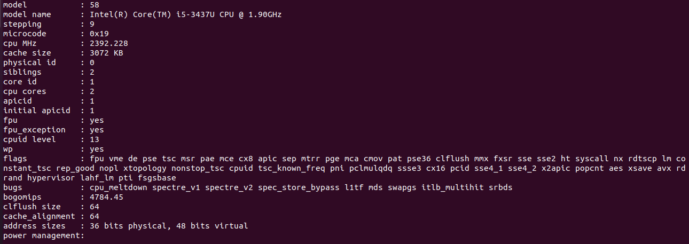

For example, some of the flags mean:
```lm```: Intel's 64-bit x86 architecture
```hypervisor```: Running on a hypervisor
```aes```: hardware-accelerated AES (secret-key cryptography)
etc …

5. Use the ps command to get information about the process. The information should be as follows: the owner of the process, the arguments with which the process was launched for execution, the group owner of this process, etc. 
To get the information about the process in a given sequence we should us some special keys:
```ps -e -o user,args,group```  

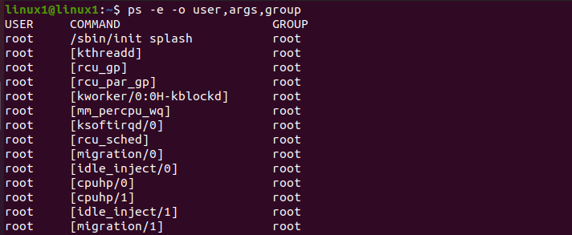
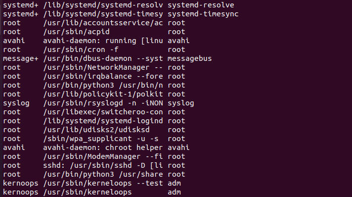
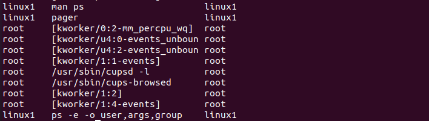

6. How to define kernel processes and user processes?
When managing processes, it is easy to recognize the kernel processes because they have a name that is between square brackets.

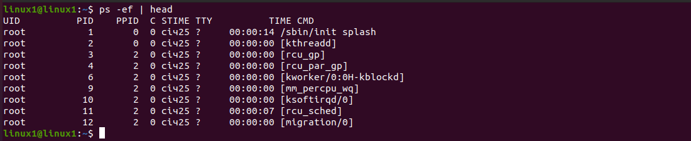


7. Print the list of processes to the terminal. Briefly describe the statuses of the processes. What condition are they in, or can they be arriving in?

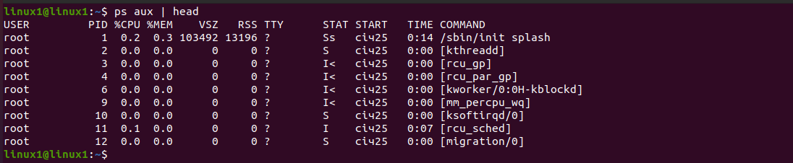

**USER** = user owning the process
**PID** = process ID of the process
**%CPU** = It is the CPU time used divided by the time the process has been running.
**%MEM** = ratio of the process’s resident set size to the physical memory on the machine
**VSZ** = virtual memory usage of entire process (in KiB)
**RSS** = resident set size, the non-swapped physical memory that a task has used (in KiB)
**TTY** = controlling tty (terminal)
**STAT** = multi-character process state
**START** = starting time or date of the process
**TIME** = cumulative CPU time
**COMMAND** = command with all its arguments

**THE CONDITIONS THAT PROCESS CAN BE ARRIVING IN ARE:**

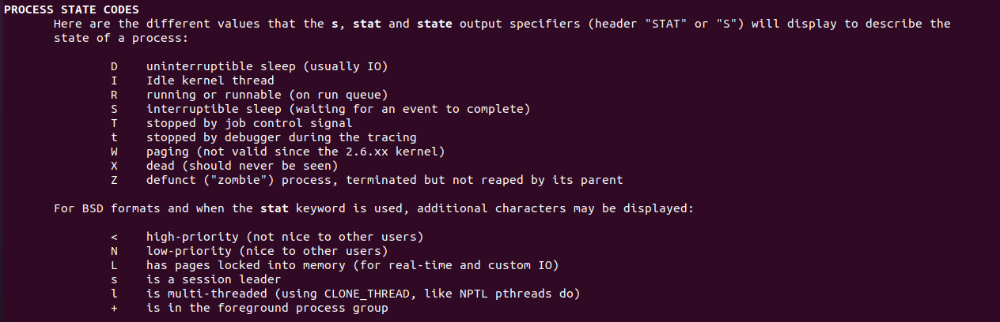

8. Display only the processes of a specific user. 
If you wish to list processes associated with a specific user, use the -u flag as shown
```ps -u user```

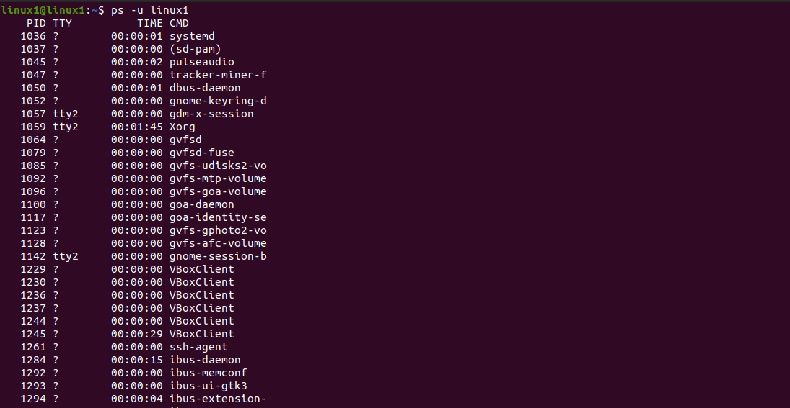

9. What utilities can be used to analyze existing running tasks (by analyzing the help for the ps command)?

Common commands for ```ps``` are:
```ps aux``` - If you are looking for a short summary of the active processes


or
```ps -ef``` - If you are not only looking for the name of the process but also for the exact command that was used to start the process


or
```ps fax``` - shows hierarchical relationships between parent and child processes.
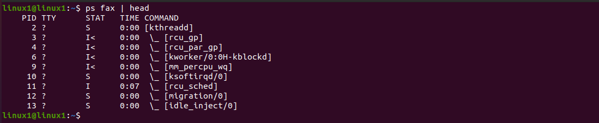

10. What information does top command display?
       The ```top``` program provides a dynamic real-time view of a running system.
       It can display system summary information as well as a  list  of  pro‐
       cesses  or  threads  currently being managed by the Linux kernel.  The
       types of system summary information shown and  the  types,  order  and
       size  of information displayed for processes are all user configurable
       and that configuration can be made persistent across restarts.

       The program provides a limited interactive interface for  process  ma‐
       nipulation  as  well  as  a much more extensive interface for personal
       configuration  --  encompassing every aspect of  its  operation.   And
       while  top  is  referred  to throughout this document, you are free to
       name the program anything you wish.  That new name, possibly an alias,
       will  then  be  reflected  on  top's display and used when reading and
       writing a configuration file.

11. Display the processes of the specific user using the top command.
To display the processes of the specific user we should us the ```top``` command with ```-u``` key.
```top -u [username]```
Example below:
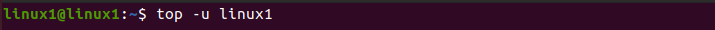  

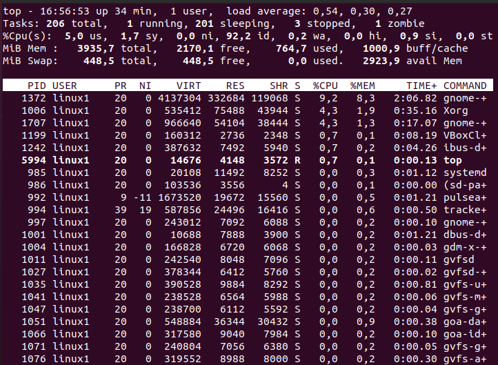

12. What interactive commands can be used to control the top command? Give a couple of examples. 
Interactive commands that can be used to control the top command:

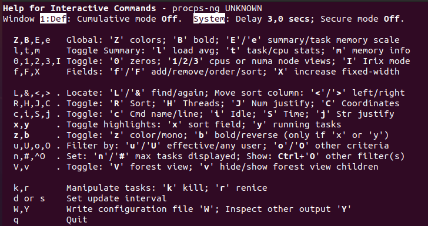

Use top command with ‘u‘ option will display specific User process details.
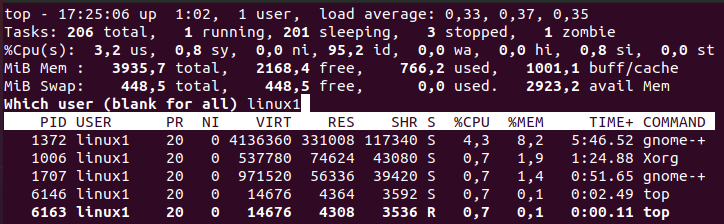

Press ‘z‘ option in running top command will display running process in color which may help you to identified running process easily.
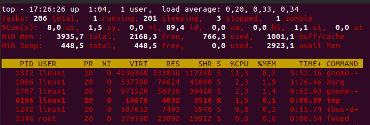

Press ‘c‘ option in running top command, it will display absolute path of running process.
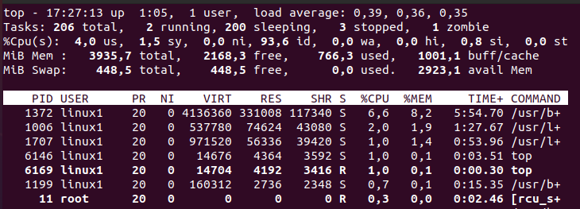

13. Sort the contents of the processes window using various parameters (for example, the amount of processor time taken up, etc.)
To sort the contents we can use the keys such as:
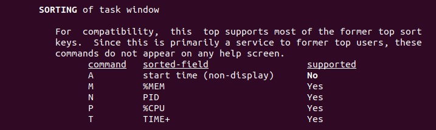

Press (Shift+P) to sort processes as per CPU utilization. See screenshot below.
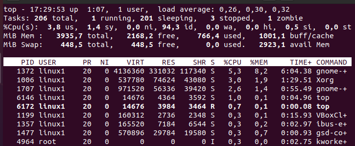

Press (Shift+N) to sort processes as per PID. See screenshot below.
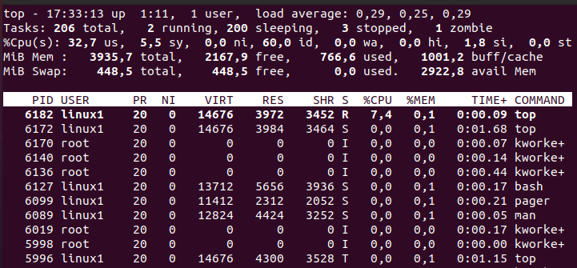

Press (Shift+M) to sort processes by memory usage (MEM). See screenshot below.
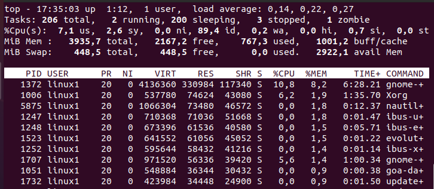

14. Concept of priority, what commands are used to set priority?
When Linux processes are started, they are started with a specific priority. By default, all regular processes are equal and are started with the same priority, which is the priority number 20. In some cases, it Is useful to change the default priority that was assigned to the process when it was started. You can do that using the ```nice``` and ```renice``` commands. Use ```nice``` if you want to start a process with an adjusted priority. Use ```renice``` to change the priority for acurrently active process. 
Examples,
```nice -10 [name or PID of process]``` - to set the priority of a process.
```nice - -10 [name or PID of process]``` - to set the negative priority for a process.

```renice -n 15 -p [PID of process]``` - changing priority of the runing process.

Note that regular users can only decrease the priority of a running process. 
You must be root to give processes increased priority.

15. Can I change the priority of a process using the top command? If so, how? 
You can use the ```top``` utility to change the priority of acurrently running process. 
Start ```top``` utility, press ```r``` and type PID number for change. Press ```Enter``` and type needed value of priority.

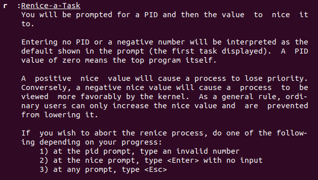

When using nice or renice to adjust process priority, you can select from values ranging from -20 to 19. The default niceness of a process is set to 0 (which results in the priority value of 20). By applying a negative niceness, you increase the priority. Use a positive niceness to decrease the priority. It is a good idea not to use the ultimate values immediately. Instead, use increments of 5 and see how it affects the application.

16. Examine the kill command. How to send with the kill command
process control signal? Give an example of commonly used signals.

Before starting to think about using the ```kill``` command or sending other signals to processes, it is good to know that Linux processes have a hierarchical relationship. Every process has a parent process, and as long as it lives, the parent process is responsible for the child processes it has created. This is particularly important when processes are terminated, because it is the parent that has to clean up the resources that were used by the children. When using ```kill``` on a parent process that still has active children, you will for that reason not just kill the parent process in question but also all of its currently active child processes.
The Linux kernel allows many signals to be sent to processes. Three of these signals work for all processes:
The signal ```SIGTERM (15)``` is used to ask a process to stop.
The signal ```SIGKILL (9)``` is used to force a process to stop.
The ```SIGHUP (1)``` signal is used to hang up a process. The effect is that the process will reread its configuration files, which makes this a useful signal to use after making modifications to a process configuration file.

To send a signal to a process, the ```kill``` command is used. The most common use is the need to stop a process, which you can do by using the ```kill -15``` command followed by the PID of the process. This sends the ```SIGTERM``` signal to the process, which normally causes the process to cease its activity.
Sometimes the ```kill``` command does not work because the process you want to kill is busy. In that case, you can use ```kill -9``` to send the ```SIGKILL``` signal to the process. Because the ```SIGKILL``` signal cannot be ignored, it forces the process to stop, but you also risk losing data while using this command. In general, it is a bad idea to use ```kill -9```:
-You risk losing data.
-Your system may become unstable if other processes depend on the process you have just killed.

17. Commands jobs, fg, bg, nohup. What are they for? Use the sleep, yes command to demonstrate the process control mechanism with fg, bg.

Job Control Commands
Job control commands enable you to place jobs in the foreground or background, and to start or stop jobs. The table describes the job control commands.

Option	 Description
```jobs``` command is used to list the jobs that you are running in the background and in the foreground. If the prompt is returned with no information no jobs are present. 
```bg %n``` Places the current or specified job in the background, where n is the job ID
```fg %n``` Brings the current or specified job into the foreground, where n is the job ID
```Control-Z``` Stops the foreground job and places it in the background as a stopped job
Example to demonstrate the process control mechanism with jobs, fg, bg.  

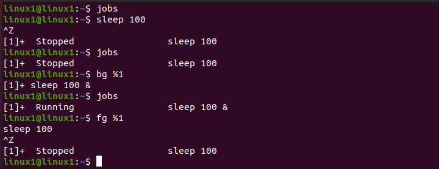

```nohup``` command prevents the processes or jobs from receiving the SIGHUP (Signal Hang UP) signal. This is a signal that is sent to a process upon closing or exiting the terminal.
1.	All processes that are run using the ```nohup``` command will ignore the SIGHUP signal even upon exiting the shell.
2.	Once a job is started or executed using the nohup command, stdin will not be available to the user.
3.	By default, the ```nohup.out``` is used as the default file for ```stdout``` and ```stderr```.


