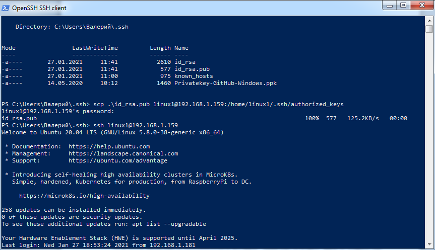

# PART 2. Basic settings, encryption, security in SSH. Port forwarding and traffic interception.

### 1. Check the implementability of the most frequently used OPENSSH commands in the MS Windows operating system. (Description of the expected result of the commands + screenshots: command – result should be presented)

First of all we have to download,  install OpenSSH server and start sshd service.

In my case I have a version for Windows.

  

  

  


I have a Linux machine with ```192.168.1.159``` ip that I would like connect to:  


After that I ping that Linux machine:

  

To connect to another host we should type the command ```ssh [username]@[hostname or ip]```  

In my case its ```ssh linux1@192.168.1.159```.  After hit the Enter I wiil be asked for password of user ```linux1```. Type it and we are in. 

  

  

If we want to connect without asking for a password, we have to generate a public/private key pair (**id_rsa and id_rsa.pub**) and copy the public one to the server we want to connect to.  

  

For copying the key we use command:

```scp [path to pub key] [username]@[hostname or ip]:[path to username authorized_keys file]```.

In my case it was:

```scp  .\id_rsa.pub linux1@192.168.1.159:/home/linux1/.ssh/authorized_keys ```  

  

When we are logged into the server, we can check the authorized_keys file for our public key.  

   

### 2. Implement basic SSH settings to increase the security of the client-server connection 

**Use SSH Keys Instead of Passwords**  

SSH keys provide a secure means of logging into an SSH server. Passwords can be guessed, cracked, or brute-forced. SSH keys are not open to such types of attack.
When you generate SSH keys, you create a pair of keys. One is the public key, and the other is the private key. The public key is installed on the servers you wish to connect to. The private key, as the name would suggest, is kept secure on your own computer.  

When you make a connection request, the remote computer uses its copy of your public key to create an encrypted message that is sent back to your computer. Because it was encrypted with your public key, your computer can unencrypt it with your private key.
When you made a pair of keys and installed private key on your computer and public on the server you wish to connect, just type the command:  

``` ssh user@ip address```

**Disable Password Authentication Altogether**  

The logical extension of using SSH keys is that if all remote users are forced to adopt them, you can turn off password authentication completely.
We need to edit your SSH configuration file:  

```sudo nano /etc/ssh/sshd_config```  

Scroll through the file until you see the line that starts with:  

```#PasswordAuthentication yes```.  

Remove the hash # from the start of the line, change the “yes” to “no”, and save the file.
Save your configuration file and restart the SSH daemon.  

``` sudo systemctl restart sshd```

**Change port 22**  

Port 22 is the standard port for SSH connections. If you use a different port, it adds a little bit of security through obscurity to your system.
Using a non-standard port can help with lowering the noise and bad traffic on port 22.
To configure a non-standard port, edit your SSH configuration file:  

```sudo nano /etc/ssh/sshd_config```  

Remove the hash # from the start of the “Port” line and replace the “22” with the port number of your choice.   

```Port 479```  

Save your configuration file and restart the SSH daemon.  

``` sudo systemctl restart sshd```

**Reject Connection Requests With No Passwords**  

Although it is a bad practice, a Linux system administrator can create a user account with no password. That means remote connection requests from that account will have no password to check against. Those connections will be accepted but unauthenticated.
The default settings for SSH accept connection requests without passwords.  We can change that very easily, and ensure all connections are authenticated.
Scroll through the file until you see the line that reads with:  

 ```PermitEmptyPasswords no```  
 
Remove the hash # from the start of the line.  

Save your configuration file and restart the SSH daemon.  

``` sudo systemctl restart sshd```

**Disable Root Login**  

It is bad practice to log in as root on your Linux computer. You should log in as a normal user and use sudo to perform actions that require root privileges. Even more so, you shouldn’t allow root to log into your SSH server. Only regular users should be allowed to connect. If they need to perform an administrative task, they should use sudo too. If you’re forced to allow a root user to log in, you can at least force them to use SSH keys.
To configure this we should edit your SSH configuration file:  

```sudo nano /etc/ssh/sshd_config```  

Remove the hash # from the start of the line:  

``` #PermitRootLogin prohibit-password```  

- If you want to prevent root from logging in at all, replace “prohibit-password” with “no”.
- If you are going to allow root to log in but force them to use SSH keys, leave “prohibit-password” in place.  

Save your configuration file and restart the SSH daemon.  

``` sudo systemctl restart sshd```

### 3. List the options for choosing keys for encryption in SSH. Implement 3 of them.  

Ssh-keygen is a tool for creating new authentication key pairs for SSH. Such key pairs are used for automating logins, single sign-on, and for authenticating hosts.
The SSH protocol uses public key cryptography for authenticating hosts and users. The authentication keys, called SSH keys, are created using the keygen program.
SSH introduced public key authentication as a more secure alternative to the older .rhosts authentication. It improved security by avoiding the need to have password stored in files, and eliminated the possibility of a compromised server stealing the user's password.  

**Creating an SSH Key Pair for User Authentication**  

The simplest way to generate a key pair is to run:  

```ssh-keygen``` 

without arguments. 

In this case, it will prompt for the file in which to store keys. Here's an example:


First, the tool asked where to save the file. SSH keys for user authentication are usually stored in the user's .ssh directory under the home directory. However, in enterprise environments, the location is often different. The default key file name depends on the algorithm, in this case id_rsa when using the default RSA algorithm.  

**Choosing an Algorithm and Key Size**  

SSH supports several public key algorithms for authentication keys. The algorithm is selected using the -t option and key size using the -b option.
These include:

**rsa** - an old algorithm based on the difficulty of factoring large numbers. A key size of at least 2048 bits is recommended for RSA; 4096 bits is better. RSA is getting old and significant advances are being made in factoring. Choosing a different algorithm may be advisable. It is quite possible the RSA algorithm will become practically breakable in the foreseeable future. All SSH clients support this algorithm.

```ssh-keygen -t rsa -b 4096```


**dsa** - an old US government Digital Signature Algorithm. It is based on the difficulty of computing discrete logarithms. A key size of 1024 would normally be used with it. DSA in its original form is no longer recommended.

```ssh-keygen -t dsa```


**ecdsa** - a new Digital Signature Algorithm standarized by the US government, using elliptic curves. This is probably a good algorithm for current applications. Only three key sizes are supported: 256, 384, and 521 (sic!) bits. We would recommend always using it with 521 bits, since the keys are still small and probably more secure than the smaller keys (even though they should be safe as well). Most SSH clients now support this algorithm.

```ssh-keygen -t ecdsa -b 521```


**ed25519** - this is a new algorithm added in OpenSSH. Support for it in clients is not yet universal. Thus its use in general purpose applications may not yet be advisable.

```ssh-keygen -t ed25519```  


In .ssh directory we have all 4 pairs of keys which were made with using of different algorithms and key size.


### 4. Implement port forwarding for the SSH client from the host machine to the guest Linux virtual machine behind NAT.  

We have a guest Linux machine with NAT connection type.  


That’s is why we cannot to ping it from our host machine. Let’s check it.


To better understand how port forwarding works, let’s install Apache webserver.  

  


After that we have to go to Network setting in VirtualBox for our guest machine and set portforwarding.  
For SSH we forwarding from Port 22 of guest machine to Port 479 of host machine.
For Apache we forwarding from Port 80 of guest machine to Port 8888 of host machine.  


First, lets check if these ports are open on the host machine. Enter ```netstat -a``` command to see a complete list of opened ports.  


And check what we have on port 8888 on the host machine


After that open the MobaXterm app and try to connect to our guest machine behind NAT via SSH with using Port 479.  


Vuala, we are in. 


Enter some command to make sure that we are on the correct machine.  


Lets see what state do we have on port 479.


### 5*. Intercept (capture) traffic (tcpdump, wireshark) while authorizing the remote client on the server using ssh, telnet, rlogin. Analyze the result.

