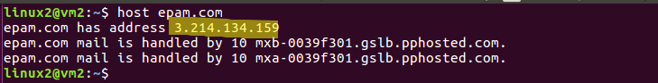

# Task 6.1. Networking with Linux
#### 1. Create virtual machines connection according to figure 1:


#### 2. VM2 has one interface (internal), VM1 has 2 interfaces (NAT and internal). Configure all network interfaces in order to make VM2 has an access to the Internet (iptables, forward, masquerade).  

Lets enable the network adapter and set it in the above modes:  

VM1 has 2 interfaces (NAT and internal).

  


VM2 has one interface (internal).  


**VM2:** Check the name of the network interface and make some settings.  

  

  

Enable the interface with the command:  

```sudo ifup enp0s3```

  

And check our settings for the interface ```enp0s3```.  

  

**VM1:** Check the name of the network interface and make some settings.  

  

.png)    

And check our settings for the interfaces ```enp0s3``` and ```enp0s8```.

  

Lets make port forwarding for connection to the host.  

  

Check the status of the port forwarding port on the host machine.

  

Connecting to VM1 from the host machine via MobaXterm.

  

  

  

We need to make some changes to ```sysctl.conf``` file and add some entries (rules) to the VM1 iptables to enable VM2 to connect to the internet.


```sudo iptables –S``` 

**Before:**

-P INPUT ACCEPT  

-P FORWARD ACCEPT  

-P OUTPUT ACCEPT  

The meaning of some keys:  

**-A** chain		 (append to chain)

**-j** target		 (target for rule)  

**-m** match		 (extended match)  

**-t** [table name]	 (table to manipulate)  

**-o** [output name]	  (network interface name)  

**-i** [input name]	 (network interface name)  

**-P** chain target	 (change policy on chain to target)

List of the commands:

```sudo iptables -t nat -A POSTROUTING -o enp0s3 -j MASQUERADE```  

```sudo iptables -A FORWARD -i enp0s8 -o enp0s3 -m state --state RELATED,ESTABLISHED -j ACCEPT```  

```sudo iptables -A FORWARD -i enp0s8 -o enp0s3 -j ACCEPT```

**After:**


Routing tables of VM1 and VM2.

  


#### 3. Check the route from VM2 to Host.

Pinging host machine (1921.168.1.181).


Checking the route fron VM2 to host machine.


#### 4. Check the access to the Internet, (just ping, for example, 8.8.8.8).

Pinging 8.8.8.8 IP address. 


Checking the route fron VM2 to 8.8.8.8 ip address.


#### 5. Determine, which resource has an IP address 8.8.8.8.  

For this purpose we use the command:  

```nslookup [ip address]```


If we want to know more not only about ip addresses but also the hostname, we need to add a DNS server to our config.  


#### 6. Determine, which IP address belongs to resource epam.com.  

For do that we may use some commands:

```dig [hostname]```  


```host [hostname]```



```ping [hostname]```


#### 7. Determine the default gateway for your HOST and display routing table.  

Firstly, we check the entire network configuration we the command:

```ipconfig```


Open the –help for the route command and select the required key:

```route PRINT```

  


#### 8. Trace the route to google.com.  

We can do this with the command:  

```mtr [hostname]```  

  


