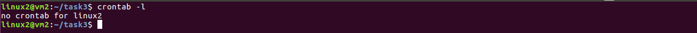
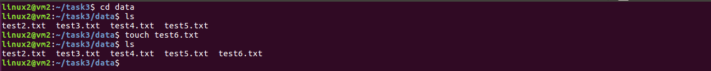

# Task 7.1. Linux administration with bash  

## Subtask A. Create a script that uses the keys described below.


#### 1. When starting without parameters, it will display a list of possible keys and their description.


#### 2. The --all key displays the IP addresses and symbolic names of all hosts in the current subnet.


#### 3. The --target key displays a list of open system TCP ports.

  

## [script.sh](TaskA.script.sh)

```Bash
#!/bin/bash

# The function that helps to display a list of IP addresses and symbolic names of all hosts in the current subnet.
function ip_addresses() {
        printf "List of IP addresses and symbolic names of all hosts in the current subnet:\n"
        host_ip=$(hostname -I | cut -f1,2,3 -d.)
        printf "$(sudo nmap -sn ${host_ip}.0/24 | awk '/Nmap scan report for/{printf $5 "\t" $6;}/MAC Address:/{print " "substr($0, index($0,$4)) }')"
}

# The function that helps to display a list of open system TCP ports.
function tcp_ports() {
        printf "List of open system TCP ports:\n"
        printf "$(sudo netstat -tlpn | awk '/tcp/{print $1, $4}')\n"
}

# The function that helps to display a list of possible keys and their description.
function info() {
            echo "Key [--all] - displays a list of IP addresses and symbolic names of all hosts in the current subnet."
            echo "Key [--target] - displays a list of open system TCP ports."
}

if [[ $# -eq 0 ]]; then
        # If no arguments
        echo "You haven't entered parameters. Here is the list of possible:"
          info
else
          for key in $@; do

              if [[ $key == "--all" ]]; then
                      ip_addresses
              elif [[ $key == "--target" ]]; then
                      tcp_ports
              else
                      echo "The key ${key} does not exists. Here is the list of possible:"
                      info
              fi
          done
fi
```


## Subtask B. Using Apache log example create a script to answer the following questions.  

Create a bash script file and set on it executible permission.  

  

When starting without parameters, it will display a list of possible keys and their description.


#### 1. From which ip were the most requests? 
Key ```--m```

#### 2. What is the most requested page?
Key ```--r```

#### 3. How many requests were there from each ip?
Key ```--ip```

#### 4. What non-existent pages were clients referred to?
Key ```--n```

#### 5. What time did site get the most requests?
Key ```--mr```

#### 6. What search bots have accessed the site?
Key ```--b```


## [apache.log](TaskB.example_log.log)
## [script.sh](TaskB.script.sh)

```Bash
#!/bin/bash

# From which ip were the most requests?
function ip_were_most_requests() {
         echo "Number of reguests and ip address"
         printf "$(cat example_log.log | awk '{print$1}' | sort -n | uniq -c | sort -n | tail -1)\n"
}

# What is the most requested page?
function page_with_most_requests() {
         echo "Number of request and page address"
         printf "$(cat example_log.log | awk '{print$7}' | sort | uniq -c | sort -rn | head -n 1)\n"
}

# How many requests were there from each ip?
function number_of_requests_by_ip() {
         echo "Number of requests and ip adresses"
         printf "$(cat example_log.log | awk '{print$1}' | sort | uniq -c | sort -rn)\n"
}

# What non-existent pages were clients referred to?
function non_existent_pages() {
         echo "Number of requests and page addresses"
         printf '%s\n' "$(cat example_log.log | grep "404" | cut -f7 -d' ' | sort | uniq -c | sort -rn)\n"
}

# What time did site get the most requests?
function time_most_request() {
         echo "Time with the most requests"
         printf "$(cat example_log.log | awk '{print $4}' | cut -d/ -f3 | cut -d: -f2,3,4 | uniq -c | sort -n | tail -1)\n"
}

# What search bots have accessed the site?
function search_bots() {
         echo "Here is a list of all search bots:"
         printf "$(cat example_log.log | grep -i 'bot/' | rev | cut -d' ' -f2 | rev | cut -d';' -f1 | sort | uniq)\n"
}


# The function that helps to display a list of possible keys and their description.
function info() {
            echo "--m : From which ip were the most requests?"
            echo "--r : What is the most requested page?"
            echo "--ip : How many requests were there from each ip?"
            echo "--n : What non-existent pages were clients referred to?"
            echo "--mr : What time did site get the most requests?"
            echo "--b : What search bots have accessed the site?"
}

if [[ $# -eq 0 ]]; then
        # If no arguments
        echo "You haven't entered parametrs. Here is the list of possible."
          info
else
          for key in $@; do

                  if [[ $key == "--m" ]]; then
                          ip_were_most_requests
                  elif [[ $key == "--r" ]]; then
                          page_with_most_requests
                  elif [[ $key == "--ip" ]]; then
                          number_of_requests_by_ip
                  elif [[ $key == "--n" ]]; then
                          non_existent_pages
                  elif [[ $key == "--mr" ]]; then
                          time_most_request
                  elif [[ $key == "--b" ]]; then
                          search_bots
                  else

                          echo "The key ${key} does not exists. Here is the list of possible:"
                          info
                  fi
          done
fi
```

## Subtask C. Create a data backup script that takes the following data as parameters:

1. Path to the syncing directory.
2. Path to the directory with backup.
3. Path to the directory with logs and temp files.

In case of adding new or deleting old files, the script must add a corresponding entry to the log file indicating the time, type of operation and file name. 
The command to run the script must be added to crontab with a run frequency of one minute.  

Create a bash script file and set on it executible permission.

  

Create **data**, **backup**, **logs** directories.


Cheking crontab file for our user.



Go to the directoey **data** and create 5 files.


Lets launch our script with required parameters and check out crontab file once more.


Go to the **log** directory and check out our log file.


Remove one (test1.txt) of the files.


Checking the log file to see what happend after the file was deleting. 


Lets add a file (test6.txt).



Checking the log file to see what happend after the file was deleting. 


## [script.sh](TaskC.backup.sh)

```Bash
#!/bin/bash

# Path to data dir
sync_dir=${1}

# Path to backup dir
backup_dir=${2}

# Path to dir with logs and temp files
logs_dir=${3}


diff -r $sync_dir $backup_dir | cut -f3,4 -d' ' > $logs_dir/temp

printf "%20s\t%20s\t%20s\n"   "Type"         "Name"         "Time"


if [ ! -e ${logs_dir}/log.log ]; then
        #current crontab
        crontab -l > $logs_dir/cron
        #add new cron task
        echo " * * * * * /home/linux2/task3/backup.sh ${sync_dir} ${backup_dir} ${logs_dir}" >> $logs_dir/cron
        #set new cron file
        crontab $logs_dir/cron
        rm $logs_dir/cron
fi


cat $logs_dir/temp | while read line
do
        file_name="$(echo $line | cut -d ' ' -f 2)"
        folder_name="$(echo $line | cut -d : -f 1)"
 
        if [[ "$folder_name" == "$sync_dir" ]]; then
            cp ${folder_name}/${file_name} $backup_dir
            name=$(stat --format=%n ${folder_name}/${file_name} | rev | cut -d/ -f1 | rev)
            last_mod_time=$(date -r ${folder_name}/${file_name} "+%H:%M")
            printf "%20s\t%20s\t%20s\n" "File added" ${name} ${last_mod_time}
            printf "%20s\t%20s\t%20s\n" "File added" ${name} ${last_mod_time} | tee --append ${logs_dir}/log.log >/dev/null
        
        elif [[ "$folder_name" == "$backup_dir" ]]; then
            name=$(stat --format=%n ${folder_name}/${file_name} | rev | cut -d/ -f1 | rev)
            last_mod_time=$(date -r ${folder_name}/${file_name} "+%H:%M")
            printf "%20s\t%20s\t%20s\n" "File deleted" ${name} ${last_mod_time}
            printf "%20s\t%20s\t%20s\n" "File deleted" ${name} ${last_mod_time} | tee --append ${logs_dir}/log.log >/dev/null
        fi

done

if [ -e ${logs_dir}/log.log ]; then
        rm $backup_dir/* && cp $sync_dir/* $backup_dir
fi

rm $logs_dir/temp
```
