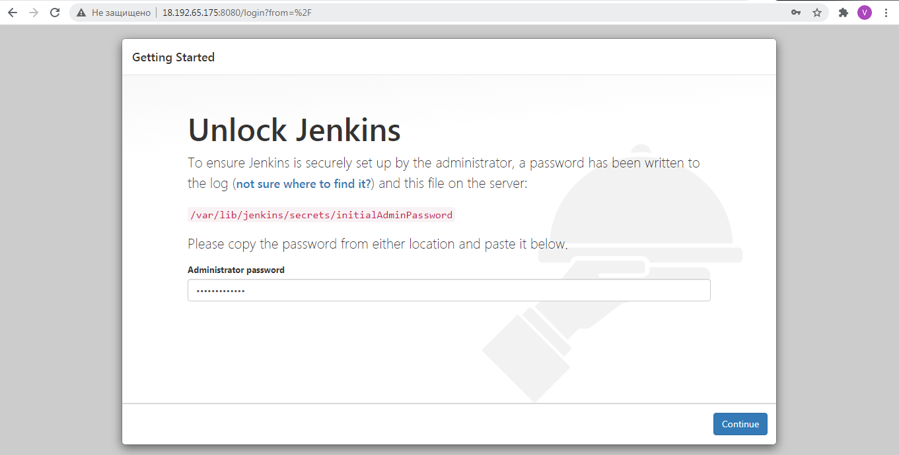
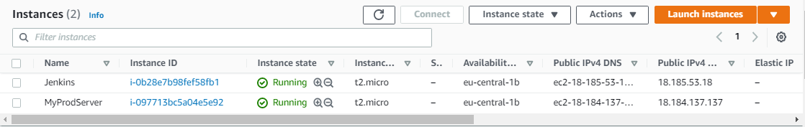

# Task 8.1. Jenkins Task

## Create some templates using lection materials about Jenkins according your final task.

Create ec2-instance in my AWS account for Jenkins installation.  

  
  
Connect to ec-2 instance via SSH with MobaXterm.  

  

Connection established. 

  

Visit site Jenkins.io and find out how to install Jenkins on Linux machine. Required commands below:  

   
 
Check the list of installed packages and Jenkins service status. 

Copy initial Admin Password.

And unlock Jenkins.

Expand functionality of Jenkins with suggested plugins.

Create user with admin privileges

Create a repo in GitHub named Jenkins_Task. Connect to linux machine and create index.html and image directory. After that, set up Git (user name and email) and do your first commit. 

Copy the SSH key to Git account for Jenkins to visit.

Configure webhook to allow Jenkins to be notified of any events happen in our repo.

Create one more ec2-instance for our future deployment.

> Important! I did this task in 2 days and disabled my instances, so in some screenshots I have different IPs. 

> Jenkins Server: Old ip 18.192.65.175 New ip 18.185.53.18

> Prod Server: Old ip 3.127.147.149 New ip 18.184.137.137

Install Apache server on the second (Prod) server.

Start our first Jenkins job (My Jenkins Task). Indicate which github project we will use.

Type repository url and credential (Ssh key) for github account.

Check checkbox with GitHub hook trigger.

Enter the commands to be executed during the Build phase.

Go to the "Manage Plugins" in Jenkins and set up credentials (ip, login, ssh key) and a remote directory for our Prod server.

Create post-build action (copy our index.html and image directory to Prod Server).

	

Launch our Job and look at the Console Output.

	

Check our Prod Server. It works!

	

After that, lets make some changes to our html file and test our CI/CD pipeline.

Was:

Now (type Spring instead of Winter):

Commit our changes and check what happens.

After committing our Job on Jenkins was launched via webhook.

Job is completed.

Our changes took effect.

Check up our commit in GitHub.

Our servers.

