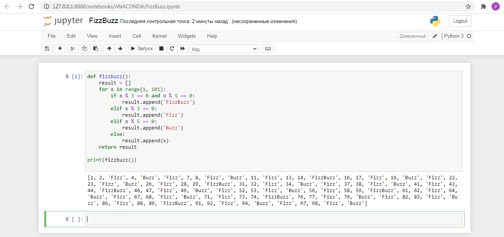
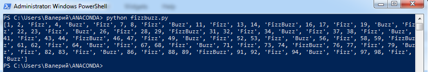
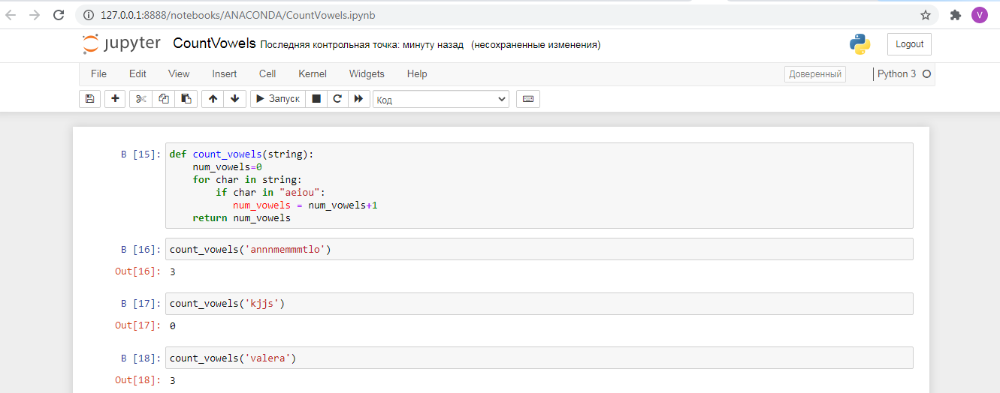

# Task 9.1. Python essentials  

## 1. Develop fizzbuzz function for list of numbers from 1 to 100. (Check in Jupyter)
If number divided by 3 without rest, print “Fizz”,
If number divided by 5 without rest, print “Buzz”,
If number divided by 3 and 5 without rest, print “FizzBuzz”.

## FizzBuzz function. File fizzbuzz.py

```Python
def fizzbuzz(n):
    result = []
    for x in range(1, 101):
        if x % 3 == 0 and x % 5 == 0:
            result.append("fizz buzz")
        elif x % 3 == 0:
            result.append('fizz')
        elif x % 5 == 0:
            result.append('buzz')
        else:
            result.append(str(x))
    return result
```

Checking up how it works in **Jupyter Notebook**



Checking up how it works in **Windows PowerShell**




## 1*. Make unit tests for your new FizzBuzz function.  

## fizzbuzz init test. File unittest.py

```Python
import fizzbuzz
import unittest

class FizzBuzzTest(unittest.TestCase):

    def test_fizz(self):
        number = 6
        result = fizzbuzz.fizzbuzz(number)
        self.assertEqual(result, 'Fizz')
    
    def test_buzz(self):
        number = 50
        result = fizzbuzz.fizzbuzz(number)
        self.assertEqual(result, 'Buzz')

    def test_fizzbuzz(self):
        number = 30
        result = fizzbuzz.fizzbuzzy(number)
        self.assertEqual(result, 'FizzBuzz')
    
if __name__ == '__main__':
    unittest.main()
```


## 2. Develop count_vowels function for counting vowels in input text.

## count_vowels function. File countvowels.py  

```Python
def count_vowels(string):
    num_vowels=0
    for char in string:
        if char in "aeiou":
           num_vowels = num_vowels+1
    return num_vowels
```

Checking up how it works in **Jupyter Notebook** 



